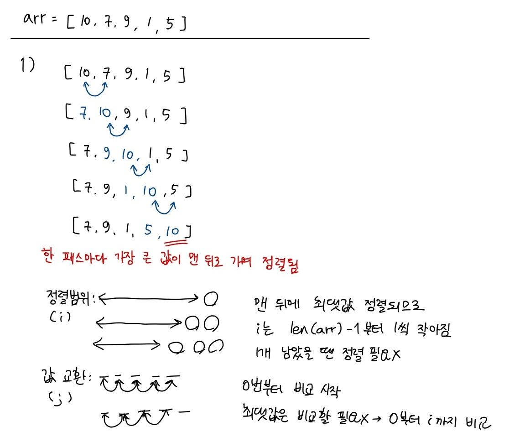

### 목차

- [Algorithm - 배열1](#algorithm---배열1)
  * [버블 정렬](#버블-정렬)
  * [카운팅 정렬](#카운팅-정렬)
  * [완전검색(Brute-force)](#완전검색brute-force)
  * [Greedy](#greedy)

<br>

# Algorithm - 배열1

## 버블 정렬

- 인접한 두 개의 원소를 비교하며 자리를 계속 교환
- 시간 복잡도 O(n^2)



 

```python
def bubble_sort(arr):
    # 한 패스마다 정렬된 맨 뒤의 최댓값을 제외한 범위에 대해
    for i in range(len(arr)-1, 1, -1):
        # [0]<->[1], [1]<->[2] .. 맨 앞부터 인접한 값 비교
        for j in range(i):
            if arr[j] > arr[j+1]:
                arr[j], arr[j+1] = arr[j+1], arr[j]
    
    return arr
```

<br>

## 카운팅 정렬

- 집합에 각 항목이 몇 개씩 있는지 세서 항목들을 정렬 -> 카운트 배열 따로 만듦
- **카운트 배열의 인덱스 = 항목의 값** -> 최댓값을 알아야 그 길이만큼의 배열 만들 수 있음
- 시간 복잡도: O(n+k) -> n은 리스트 길이, k는 정수 최댓값
- **n이 비교적 작을 때만 가능!**


```python
def counting_sort(arr):
    counts = [0] * (max(arr)+1)
    result = [0] * len(arr)

    # counts 배열 생성
    for num in arr:
        counts[num] += 1
    
    # 누적식으로 변경
    for i in range(1, len(counts)):
        counts[i] = counts[i-1] + counts[i]
    
    for j in range(len(arr)-1, -1, -1):
        # counts 값은 1부터 시작 -> 인덱스가 되려면 -1씩 해줘야 함!
        counts[arr[j]] -= 1
        result[counts[arr[j]]] = arr[j]
    
    return result
```

<br>

## 완전검색(Brute-force)

- 해법으로 생각할 수 있는 모든 경우의 수를 나열해보고 최종 해법 도출

- 경우의 수가 상대적으로 작을 때 유용

- 수행 속도는 느리지만 해답을 찾아낼 확률 큼

- 경우의 수 생성

  - 순열: 순서대로 뽑아서 줄 세우기

    - nPr = n * (n-1) * (n-2) * ... * (n-r+1)

    ```python
    # {1, 2, 3} 을 포함하는 모든 순열을 생성하는 법
    for i in range(1, 4):
        for j in range(1, 4):
            if j != i:
                for k in range(1, 4):
                    if k != i and k != j:
                        print(i, j, k)
    ```

<br>

## Greedy

- 여러 경우 중 하나를 결정해야 할 때마다 그순간에 최적이라고 생각되는 것을 선택해나가는 방식으로 진행 -> 최종적인 해답에 도달
- 보통 머릿속에 떠오르는 생각을 검증 없이 바로 구현하면 Greedy 