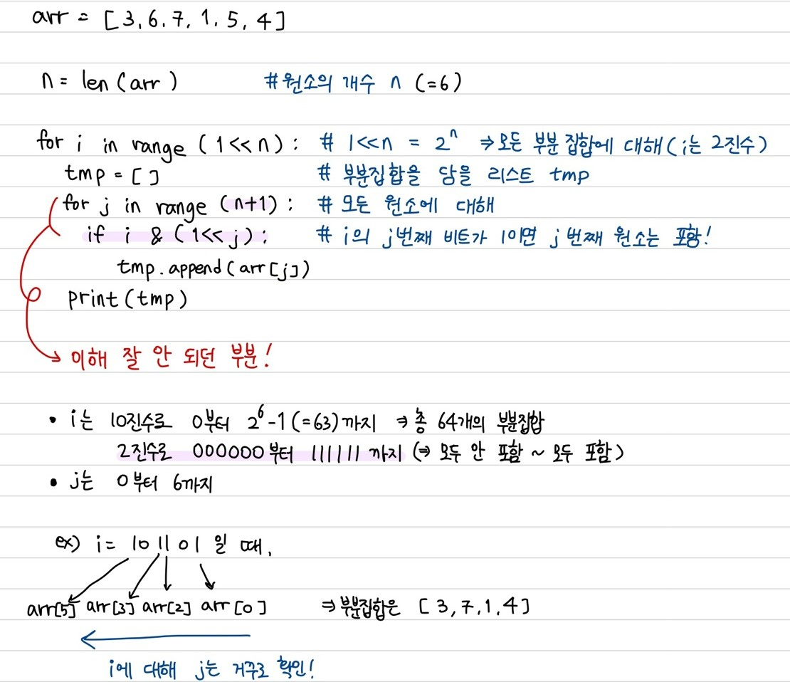

### 목차

- [배열 - 부분집합](#배열---부분집합)
  * [부분집합](#부분집합)
  * [비트연산](#비트연산)

<br>

## 배열 - 부분집합

### 부분집합

```python
# 부분집합을 구할 수 있는 모듈
from itertools import combination

# 단 코테 환경에 따라 사용 막을 수 있으니 직접 구할 줄도 알아야 함!
```

### 비트연산

- 모든 조합을 구하기 위해 사용
- `nCr` : C는 Combination(조합)! n개 중에 r개를 뽑겠다
- 경우의 수가 많아지면 재귀함수나 비트연산이나 비슷
- 그렇지 않은 경우 재귀함수는 속도가 좀 늘어짐

```python
# 모든 경우를 가져오기 위함
# selected / not => 매 요소마다 적용
# 비트 연산을 통해 binary로 처리됨
# 1 << n == 2 ** n

n = 3
# 3개의 숫자에 대해 각각 포함하거나 포함하지 않거나->2가지 경우
# 원소가 3개일 때 모든 부분집합의 수 = 8
# 1 << 3 == 2 ** 3 == 8
# i: 0 ~ 7

# i & (1 << j): element

# j : 0, 1, 2

# 1 << j
# 0 0 1
# 0 1 0
# 1 0 0

# 3C2
n = 3
r = 2

target = ['a', 'c', 'zzz']
# j => 0, 1, 2
# j를 이용해 str도 조작 가능!

# 연산은 bit지만 결과는 decimal!!
# all case(모든 부분집합에 대해)
for i in range(1 << n):
    result = ''
    count = 0
    # combi.
    # 각 원소의 포함 여부 확인
    for j in range(n):
        
        # check element
        # i에 대해 j를 통해 한 자리씩 1인지 검사함
        # 2진수로 바꾼 i의 해당 자리 숫자가 1인 경우에만 참
        # 즉, 해당 if문의 결과는 0 or 1
        if i & (1 << j):
            # 1 => selected
            count += 1
            result += target[j]
        
        if count == r:
            # result of combi
            print(i)
```



- 코드

  ```python
  # nCr
  
  matrix = [1, 2, 3]
  
  n = len(matrix)
  r = 2
  
  candidate = [0] * n
  
  # [1, 0, 0] => 1st
  # [1, 1, 0] => 2nd
  
  # 현재 검사중인 숫자 now
  def rec(now, count):
      if count == r:
          result = 0
          for idx, is_selected in enumerate(candidate):
              if is_selected:
              	result += matrix[idx]
          print(candidate, result)
          return
     	for i in range(now, n):
          if not candidate[i]:
              # i번째 요소가 선택되지 않았다면
              candidate[i] = 1
              rec(i+1, count+1)
              candidate[i] = 0
  
  rec(0, 0)
  ```

  
