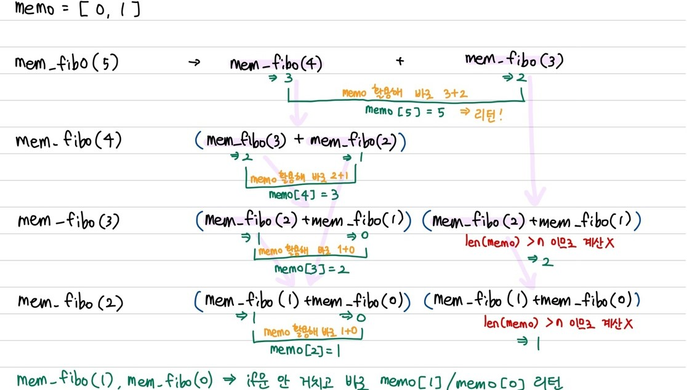

### 목차

- [Algorithm - stack](#algorithm---stack)
  * [Stack](#stack)
  * [재귀호출](#재귀호출)
  * [Memoization](#memoization)
  * [DP(Dynamic Programming): 동적 계획](#dpdynamic-programming-동적-계획)
  * [DFS](#dfs)

<br>

# Algorithm - stack

<br>

## Stack

- 자료를 선형으로 저장(자료 간 1:1 관계)
- LIFO구조(Last In First Out)


- 연산

  - 삽입: push

    ```python
    def push(item):
        s.append(item)
    ```

  - 삭제: pop

    ```python
    def pop():
        if len(s) == 0:
            # underflow
            return
        else:
            # s.pop() 도 가능
            return s.pop(-1)
    ```

  - 스택이 공백인지 아닌지 확인: isEmpty

  - top에 있는 item 반환: peek


- 스택 구현 고려사항
  - 1차원 배열을 사용하여 구현할 경우 구현 용이 but 스택의 크기 변경 어려움
  - 이를 해결하기 위해 동적 연결리스트를 이용해 구현 -> 구현이 복잡하지만 메모리를 효율적으로 사용

<br>

## 재귀호출

- 자기 자신을 호출하여 순환 수행되는 것 -> 코드를 보다 간결하게 작성할 수 있음

- 재귀호출의 예: 피보나치 수열

  ```python
  def fibo(n):
      if n < 2:
          return n
      else:
          return fibo(n-1) + fibo(n-2)
  ```

- 재귀호출의 단점

  : 엄청난 중복 호출 존재

  위의 fibo() 함수에서 n=5일 때, fibo(3) 2번, fibo(2)  3번, ... 중복 호출

<br>

## Memoization

- 컴퓨터 프로그램 실행 시 **이전에 계산한 값을 메모리에 저장** -> 매번 다시 계산하지 않도록 하여 전체적인 실행속도를 빠르게 하는 기술 (동적 계획법의 핵심 기술)
- memoization: to put in memory

```python
def mem_fibo(n):
    global memo
    if n >= 2 and len(memo) <= n:
        memo.append(mem_fibo(n-1) + mem_fibo(n-2))
    return memo[n]

memo = [0, 1]
print(mem_fibo(5))
# [0, 1, 1, 2, 3, 5] 25p
```



<br>

## DP(Dynamic Programming): 동적 계획

- 그리디 알고리즘과 같이 최적화 문제를 해결하는 알고리즘
- 입력 크기가 작은 부분 문제들을 모두 해결한 후에 그 해들을 이용해 보다 큰 크기의 부분 문제들을 해결 -> 최종적으로 원래 주어진 입력의 문제를 해결 (분할 정복과 비슷한 느낌)

```python
def dp_fibo(n):
    f = [0, 1]
    for i in range(2, n+1):
        f.append(f[i-1] + f[i-2])
    return f[n]
```

- memoization을 재귀적 구조에 사용하는 것보다 반복적 구조로 dp를 구현한 것이 성능 면에서 보다 효율적임

  재귀 호출을 통해 해당 인덱스 값을 리턴받는 것보다 바로 인덱스를 이용하는 것이 더 빠름

<br>

## DFS

- 비선형구조인 그래프는 그래프로 표현된 모든 자료를 빠짐없이 검색하는 것이 중요 -> 모든 자료를 탐색하는 방법 DFS, BFS
- 시작 정점으로부터 한 방향으로 경로가 있다면 갈 수 있는 데까지 깊이 탐색 -> 더 이상 갈 곳이 없으면 가장 최근의 갈림길로 되돌아와서 다른 방향으로 탐색
- 스택 사용: 가장 **최근**에 만난 갈림길의 정점으로 되돌아가서 다시 깊이우선탐색을 해야 하므로

```python
def dfs(v):
    visited[v] = 1
    for w in route[v]:
        if not visited[w]:
            dfs(w)
            
route = [[] for _ in range(vertices + 1)]
visited = [[] for _ in range(vertices + 1)]
for start, end in se_list:
    route[start].append(end)
dfs(1)

if visited[10] == 1:
    result = 1
else:
    result = 0
```

