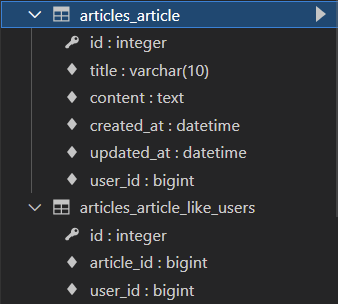

[toc]

# DB 03: Model Relationship 2

- 1:N과 N:M

  

## Intro

- 의사의 예약 환자 조회

```shell
for reservation in doctor1.reservation_set.all(): print(reservation.patient.name)

# 출력
# tony
# harry
```

### ManyToManyField

- M:N 관계 설정 시 사용하는 모델 필드

- doctor/patient 둘 중 한 곳에 작성

  => `앱이름_모델이름_필드명`으로 테이블 만들어짐. 중개 테이블 Reservation과 같은 형태!


- 인스턴스 이용해서 추가/삭제

  - 추가하는 법: `add()`

      ```shell
      # 둘이 모델 매니저가 다름!

      # Patient에서 MTM field 작성했으므로 필드명 바로 사용 가능
      patient1.doctors.add(doctor1)
      # Doctor에서는 _set 매니저 사용(역참조)
      doctor1.patient_set.add(patient2)

      # ManyToMany 필드 사용 안 하면 예약 추가/삭제할 때 reservation에서 찾아서 추가/삭제 -> 단계가 하나 더 늘어남!
      ```

  - 조회하는 법

      ```shell
      # patient에서는 참조
      patient1.doctors.all()
      
      # doctor에서는 역참조
      doctor1.patient_set.all()
      ```

  - 삭제하는 법: `remove()`

      ```shell
      patient2.doctors.remove(doctor1)
      
      doctor1.patient_set.remove(patient1)
      ```

- related_name

  - 역참조 시에 사용하는 매니저의 이름을 설정하는 것 -> 더 이상 _set 매니저 사용 불가
  
  - migrate 다시 해야 함
  
  ```python
  class Patient(models.Model):
      # related_name은 역참조 할 때(Doctor가 Patient를 참조하고자 할 때) 사용하는 이름 -> doctor는 patient를 patients로 조회! doctors 아님
      doctors = models.ManyToManyField(Doctor, related_name='patients')
      name= models.TextField()
  ```
  
  ```shell
  doctor1.patients.all()
  ```

- 중개 모델(테이블) in Django

  - 중개 테이블을 직접 작성하는 경우 `through` 옵션 사용해서 중개 테이블을 나타내는 Django 모델 지정 가능

    -> `through` 옵션을 사용하더라도 ManyToMany field를 사용하는 이유? manager 를 사용하기 위해

    ->`patient1.doctors.all()` `doctor1.patient_set.all()` 참조 역참조 모델 매니저 그대로 사용 가능

  - 일반적으로 중개 테이블에 추가적인 데이터를 사용하려는 경우에 직접 작성

    ```shell
    reservation1 = Reservation(doctor=doctor1, patient=patient1, symptom='headache')
    reservation1.save()
    ```


<br>

## ManyToManyField

- `ManyToManyField`

  - M:N(many-to-many) 관계 설정 시 사용하는 모델 필드

  - 하나의 필수 위치인자(모델 클래스) 필요! related_name은 필수 아님

  - 모델 필드의 RelatedManager를 사용하여 관련 개체 추가/삭제 가능

    ex) `add()`, `remove()`

- `ManyToManyField`'s argument

  - `related_name`

    - 역참조 시 사용할 manager의 이름 설정

    ```python
    class Article(models.Model):
        user = models.ForeignKey(settings.AUTH_USER_MODEL, on_delete=models.CASCADE)
        # article의 입장에서 좋아요를 누른 유저를 조회
        # related_name 설정 안 하면 user, like_users 의 역참조 매니저 이름이 같아서 충돌 일어남
        
        # 1 : N
        # article.user
        # user.article_set
        
        # N : M
        # article.like_users
        # user.article_set => user.like_articles
        like_users = models.ManyToManyField(settings.AUTH_USER_MODEL)
        # like_users 라는 manytomany 필드는 컬럼을 새로 만들지 않음! 중개 테이블을 만드는 것
    ```

  - `through`

    - 중개 테이블을 직접 작성하는 경우, 중개 테이블을 나타내는 장고 모델 지정

  - `symmetrical`

    - ManyToManyField가 동일한 모델(자기 자신)을 가리키는 정의에서만 사용 ex) follow 구현할 때 User와 User가 M:N 관계
    - 'self', 'User',  AUTH_USER_MODEL 등 가능! but `'self'`를 권장
    - comment랑 article에서 순서 바뀌었을 때 'Article' 이렇게 글자 바꿔서 표현하듯이..? User도 가능한 것 => 이게 뭔 말이지
    - 탈퇴하면 팔로우/팔로잉 두 곳에서 모두 사라짐

    - `symmetrical=True`
      - 내가 팔로우하면 상대방도 나를 팔로우하게 됨(대칭) -> 역참조 필요 X
      - django는 person_set 매니저 추가 X, related_name 작성해도 동작 X
    - `symmetrical=False`
      - 역참조 할 수 있으므로 related_name 설정 가능

<br>

## Like

- 좋아요가 N:M인 이유

  : 유저는 여러 게시글에 좋아요를 누를 수 있음 & 게시글은 여러 유저로부터 좋아요를 받을 수 있음

  유저와 게시글 => N:M

  좋아요 => 중개 테이블

- ManyToManyField 작성

  ```python
  # articles/models.py
  
  class Article(models.Model):
      # 두 필드 모두 유저 모델을 참조 -> 역참조 매니저 이름 article_set으로 겹침
      # 두 필드 중 한 곳에 related_name 작성!
      user = models.ForeignKey(settings.AUTH_USER_MODEL, on_delete=models.CASCADE)
      like_users = models.ManyToManyField(settings.AUTH_USER_MODEL, related_name='like_articles')
  ```

  - User - Article 간 사용 가능한 DB API
    - `article.user` - 1:N, 참조
    - `user.article_set` - 1:N, 역참조
    - `article.like_users` - M:N, 참조
    - `user.like_articles` - M:N, 역참조

  

  

  - articles_article엔 ManyToManyField 관련 내용 없음
  - 중개 테이블(`articles_article_like_users`)에서 따로 관리

- QuerySet API - `exists()`

  - in 연산자와 같은 기능
  - 규모가 클 수록 exists()를 사용하는 게 더 좋음

<br>

## Profile Page

url - view 함수 - 템플릿 작성 - base/index 페이지에 프로필 링크 작성

## Follow

- ManyToManyField 작성

  ```python
  # accounts/models.py
  
  class User(AbstractUser):
      followings = models.ManyToManyField('self', symmetrical=False, related_name='followers')
  
  # => accounts_user_followings 라는 이름으로 중개 테이블 만들어짐
  # pk, from_user_id, to_user_id 컬럼 있음
  ```

---

- 어떤 기능을 구현하는 데 모델이 필요하다 -> DB를 사용한다 -> 백엔드 필요 => Dynamic Web
- DB 사용 없으면 Static Web 형태로 HTML만 갖고도 구현 가능 -> Flexbox Froggy 처럼 (DB 없이 DB를 흉내내서 쿠키나 local storage로 담기 때문에 내가 풀었던 게 담기는! JS로 처리될 듯)


- +) N + 1 problem

  : 중개 테이블 활용하다 보면 발생할 수 있는 문제

  내용을 불필요하게 중복 조회하는 경우

  => 장고에서는 `select_related()`활용해서 해결?

- django orm lazy loading: 장고 all() 했을 때가 아니라 그걸 실제로 사용했을 때 로딩 (선언했을 때가 아니라 사용됐을 때! 사용되는 시점마다 불려옴) => sql 문장을 최대한 최적화 시키는 orm 사용법이 중요


uri, url에는 대상, 목적만 보여주게 하는 게 RESTful

하지만 장고는 그렇지 않게 사용하고 있음! login 동작이 url 주소가 되니까

form의 한계: GET/POST 메서드만 사용 가능 -> 그렇기 때문에 url에 다른 정보들이 들어감


인덱스 페이지에서 좋아요 눌렀을 때 맨 위로 이동하는 건 페이지를 리다이렉트 하기 때문

js로 처리하면 그 버튼에 대한 요청만 받음(페이지에 대한 요청 말고)