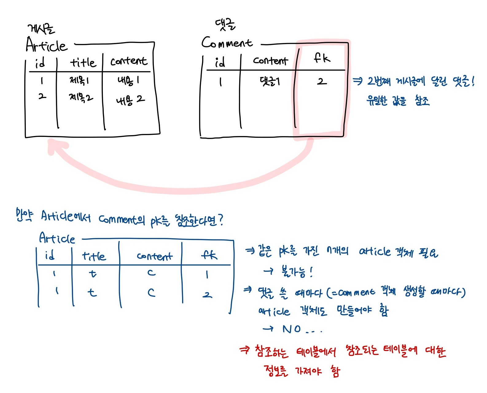
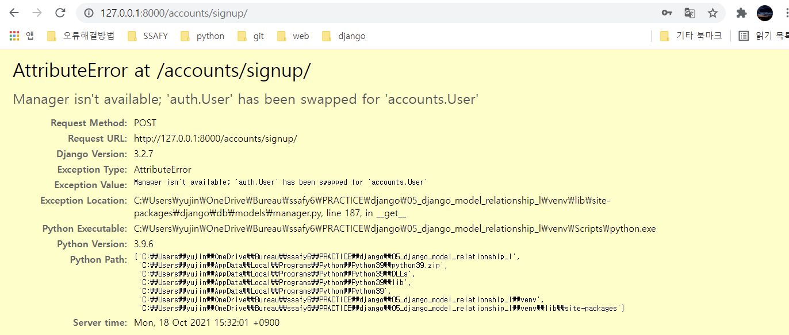

### 목차

- [DB 02](#db-02)
  * [Model Relationship 1](#model-relationship-1)
    + [Foreign Key](#foreign-key)
    + [1:N 관계 related manager](#1n-관계-related-manager)
    + [Comment CREATE](#comment-create)
    + [Comment READ](#comment-read)
    + [Comment DELETE](#comment-delete)
    + [Comment 추가사항](#comment-추가사항)
  * [Customizing authentication in Django](#customizing-authentication-in-django)
    + [Substituting a custom User model](#substituting-a-custom-user-model)
    + [Custom user & Built-in auth forms](#custom-user--built-in-auth-forms)
  * [Model Relationship 2](#model-relationship-2)
    + [User - Article & User - Comment (1:N)](#user---article--user---comment-1n)

<br>

# DB 02

## Model Relationship 1

### Foreign Key

- Foreign Key(외래키)

  - 관계형 데이터베이스에서 한 테이블의 필드 중 다른 테이블의 행을 식별할 수 있는 키

  - 참조하는 테이블에서 1개의 키에 해당 -> 참조되는 테이블의 unique한 키 (꼭 기본키가 아니어도 됨) -> 참조 무결성

    

  - articles_comment (앱이름_클래스명 형태)

    |  id  | content | created_at | updated_at | article_id  |
    | :--: | :-----: | :--------: | :--------: | :---------: |
    |      |         |            |            | 외래키 컬럼 |

<br>

- `ForeignKey` field

  - A many-to-one relationship (1:N)
  - 2개의 위치 인자 필수: 참조하는 model class, `on_delete`
  - `ForeignKey` arguments
    - `on_delete`
      - 외래 키가 참조하는 객체가 사라졌을 때 외래 키를 가진 객체를 어떻게 처리할 지 => 참조되는 객체가 사라졌을 때 참조하는 객체를 어떻게 할 지
      - 데이터 무결성을 위해 중요한 설정!
      - `on_delete=models.CASCADE` : 부모 객체가 삭제됐을 때 이를 참조하는 객체도 삭제 (폭포처럼 아래에 있는 것들 연달아 삭제)
    - `related_name`
      - 역참조 시 사용할 이름을 변경
      - 변경 시 원래 이름인 `모델명_set`은 더 이상 사용 불가
      - 이름 변경 후 migration 필요
  - migrate 시 내가 작성한 필드 이름에 `_id` 붙여서 데이터베이스 열 이름을 만듦

  - 예시

    ```python
    # articles/models.py
    
    class Comment(models.Model):
        # 필드명은 참조하는 클래스 이름의 소문자형으로 작성하는 게 바람직!
        article = models.ForeignKey(Article, on_delete=models.CASCADE)
        content = models.CharField(max_length=200)
        created_at = models.DateTimeField(auto_now_add=True)
        updated_at = models.DateTimeField(auto_now=True)
    ```

<br>

- shell_plus 연습

  - pk값을 직접 넣는 게 아니라 객체를 할당 ex) Article의 객체 article

    ```shell
    article = Article.objects.create(title='제목', content='내용')
    
    comment = Comment()
    comment.content = 'content'
    comment.article = article
    # or
    comment = Comment(content='second', article=article)
    
    comment.save()
    ```

  - 참조되는 아티클의 기본키 값을 알고 싶다면?

    `comment.article_id` / `comment.article.pk`

    => 둘 다 같은 값을 가짐! 외래키 컬럼명을 직접 사용 or 객체에 접근해서 객체의 pk 가져옴

    `comment.article_pk`는 안 됨!!!

  - 댓글이 작성된 게시글의 내용을 알고 싶다면?

    `comment.article.content` -> 댓글이 참조하는 article 객체의 필드 중에 content 가져옴

  - 

    => 1번 게시글을 참조하는 2개의 댓글(1:N)

<br>

### 1:N 관계 related manager

- 참조 (`article`)

  - N에서 1을 참조하는 것 -> 댓글이 게시글을 참조하는 것
  - comment.article과 같이 접근 가능 (클래스 변수니까?)

- 역참조 (`comment_set`)

  - 1에서 N을 참조하는 것

  - article.comment는 안 됨 -> 1에게는 N에 대한 정보가 없음 -> 장고가 `article.comment_set` manager 생성 (comment는 Comment 모델 이름 따온 것, 댓글이 N개이므로 set이라는 이름을 가짐)

    ex) `article.comment_set.all()`

<br>

### Comment CREATE

- CommentForm 작성

  ```python
  # articles/forms.py
  
  from .models import Article, Comment
  
  class CommentForm(forms.ModelForm):
      class Meta:
          model = Comment
          # 댓글 작성 폼에서 어떤 글에 작성할지 선택할 수 없도록
          exclude = {'article', }
  ```

- urls.py 작성

  ```python
  urlpatterns = [
      # ...
      # detail 템플릿에 댓글작성 폼이 있고, 댓글 작성 시 보내는 url이 여기! 그리고 views.py에서 comments_create 함수를 실행하고 나면 다시 detail 페이지로 redirect 됨
      path('<int:pk>/comments/', views.comments_create, name='comments_create'),
  ]
  ```

- views.py 작성

  ```python
  # articles/views.py
  
  from .forms import ArticleForm, CommentForm
  
  # 댓글 작성 폼 렌더
  def detail(request, pk):
      article = get_object_or_404(Article, pk=pk)
      comment_form = CommentForm()
      context = {
          'article': article,
          'comment_form': comment_form,
      }
      return render(request, 'articles/detail.html', context)
  
  @require_POST
  def comments_create(request, pk):
      if request.user.is_authenticated:
          article = get_object_or_404(Article, pk=pk)
          comment_form = CommentForm(request.POST)
          if comment_form.is_valid():
              # save 하기 전에, foreign key 지정해줘야 함!
              # form에서 사용자가 글을 선택할 수 없게 exclude 했으므로 여기서 fk 지정해줘야 함
              comment = comment_form.save(commit=False)
              comment.article = article
              comment.save()
          return redirect('articles:detail', article.pk)
      return redirect('articles:login')
  ```

  - `save(commit=False)`
    - 아직 DB에 저장되지 않은 인스턴스를 반환

- detail.html 작성

<br>

### Comment READ

- views.py 작성

  ```python
  # articles/views.py
  
  from .forms import ArticleForm, CommentForm
  
  # 댓글 작성 폼 렌더 + 작성된 댓글들 보여줌
  def detail(request, pk):
      article = get_object_or_404(Article, pk=pk)
      comment_form = CommentForm()
      # 게시글에 대한 댓글을 가져오는 건? 1에서 N을 가져오는 역참조
      # comment_set 매니저 사용
      comments = article.comment_set.all()
      context = {
          'article': article,
          'comment_form': comment_form,
          'comments': comments,
      }
      return render(request, 'articles/detail.html', context)
  ```

- detail 템플릿에서 댓글 출력

<br>

### Comment DELETE

- urls.py 작성

  ```python
  urlpatterns = [
      # ...
      # 게시글 pk와 댓글 pk가 모두 필요!
      # 삭제하려면 특정되어야 하니까
      path('<int:article_pk>/comments/<int:comment_pk>/delete/', views.comments_delete, name='comments_delete')
  ]
  ```

- views.py 작성

  ```python
  @require_POST
  def comments_delete(request, article_pk, comment_pk):
      if request.user.is_authenticated:
          comment = get_object_or_404(Comment, pk=comment_pk)
          comment.delete()
          # comment.article.pk로 할 수도 있겠지만? url에서 comment_pk만 있게 되는 건 구조상 명시적이지 않게 됨
          return redirect('articles:detail', article_pk)
  ```

<br>

### Comment 추가사항

- 댓글 개수 출력 & 댓글 없는 경우

  ```django
  
  	<p>{{ comments|length }}개의 댓글이 있습니다.</p>
  
  
  
  	{{ comment.content }}
  
  	<p>댓글이 없습니다.</p>
  
  
  ```

<br>

## Customizing authentication in Django

### Substituting a custom User model

- User 모델 대체하기

  - 일부 프로젝트에서는 장고의 내장 User 모델이 제공하는 인증 요구사항이 적절하지 않을 수 있음

    ex) username 대신 email을 식별 토큰으로 사용하는 게 더 적합한 사이트?

  - Django는 User를 참조하는데 사용하는 `AUTH_USER_MODEL` 값을 제공 -> default user model을 재정의(override) 할 수 있도록 함

  - Django는 새 프로젝트를 시작할 때 기본 사용자 모델이 충분하더라도 **커스텀 유저 모델을 설정하는 것을 강력하게 권장** (단 프로젝트의 첫 migrate를 실행하기 전에 해야 함!)

- `AUTH_USER_MODEL`

  - User를 나타내는데 사용하는 모델
  - **프로젝트가 진행되는 동안 변경 불가**
  - 기본 값: `auth.User` (auth 앱의 User 모델)

- Custom User 모델 정의하기

  - AbstractUser를 상속받아 새로운 User 모델 작성

    ```python
    # accounts/models.py
    
    from django.contrib.auth.models import AbstractUser
    
    class User(AbstractUser):
        # 나중에 추가적으로 작성할 내용이 생기면 여기에 작성하면 됨!
        # 커스텀 유저 모델 설정 안 한 상태에서 프로젝트 중간에 AUTH_USER_MODEL 변경하려면 더 번거로워짐. User가 연결되어 있던 것들도 바꾸고..
        pass
    ```

  - 장고가 사용하는 User 모델을 auth.User에서 accounts.User로 변경

    ```python
    # settings.py
    
    AUTH_USER_MODEL = 'accounts.User'
    ```

  - admin site에 Custom User 모델 등록

    ```python
    # accounts/admin.py
    
    from django.contrib import admin
    from django.contrib.auth.admin import UserAdmin
    from .models import User
    
    admin.site.register(User, UserAdmin)
    ```

  - 프로젝트 중간에 User 모델 바꾼 뒤 초기화하는 방법

    1. db.sqlite3 파일 삭제
    2. migrations 파일 중 파일명에 숫자가 붙은 파일들 삭제

<br>

### Custom user & Built-in auth forms



- 유저 커스텀 하고 회원가입 하려고 하면 이렇게 뜸

  -> UserCreationForm & UserChangeForm이 안 됨!

  -> 기존 폼의 model은 기존 내장 User 모델을 사용한 ModelForm이기 때문

  -> ModelForm -> class Meta가 있다는 뜻 -> `model = User`로 되어 있는데 우리는 User를 대체했음 -> 상속 받아서 모델만 바꿔주면 됨(`get_user_model()`)

- AuthenticationForm이나.. 얘네는 ModelForm이 아님!

<br>

## Model Relationship 2

### User - Article & User - Comment (1:N)

- User 모델 참조하기
  1. `settings.AUTH_USER_MODEL`
  
     : models.py에서 User 모델을 참조할 땐 이렇게 사용
  
  2. `get_user_model()`
  
     : 현재 활성화된 User 모델을 반환. models.py가 아닌 다른 모든 곳에서 유저 모델을 참조할 때 사용
  
- User-Article, User-Comment 간 모델 관계 정의 후 migration

  ```python
  # articles/models.py
  
  from django.conf import settings
  
  class Article(models.Model):
      user = models.ForeignKey(settings.AUTH_USER_MODEL, on_delete=models.CASCADE)
  
  class Comment(models.Model):
      article = models.ForeignKey(Article, on_delete=models.CASCADE)
      user = models.ForeignKey(settings.AUTH_USER_MODEL, on_delete=models.CASCADE)
  ```

- Form 클래스 필드 수정

  ```python
  # articles/forms.py
  
  class ArticleForm(forms.ModelForm):
      class Meta:
          model = Article
          # 모델에 user 필드가 추가 되어서 ArticleForm에서 user를 선택할 수 있게 됨 -> 없애주기
          fields = ('title', 'content', )
          
          
  class CommentForm(forms.ModelForm):
      class Meta:
          model = Comment
          # 댓글 작성 폼에서 댓글을 작성할 게시글/사용자 선택할 수 없도록 해줌
          exclude = ('article', 'user',)
  ```

- 하지만 이렇게 하면 comment.user 정보가 없어서 IntegretyError 발생

  

- create 함수 수정

  ```python
  # articles/views.py
  
  # comment_create 함수도 동일한 방식으로 수정!
  def create(request):
      if request.method == 'POST':
          form = ArticleForm(request.POST)
          if form.is_valid():
              # save(commit=False)를 통해 객체를 받아와서
              article = form.save(commit=False)
              # request.user로 user 정보를 넣어준 다음
              article.user = request.user
              # save!
              article.save()
  ```

- 자신이 작성한 글만 수정/삭제할 수 있도록 update, delete 함수 수정

  ```python
  def update(request, pk):
      article = get_object_or_404(Article, pk=pk)
      if request.user == article.user:
          # 이 경우에만 수정 가능하도록
  ```

---

+)

- NoSQL

  - 관계성이 없음 -> 다양하게 활용 가능
  - 서버리스 컴퓨팅에서 많이 사용됨

- RDBMS

  - 테이블 간에 관계가 지어질 수 있음

  - 관계가 왜 필요할까?

    -> 일상의 추상적인 것들을 구체화&코드화해서 표현하려고

    -> 관계 형성에 기반한 테이블 구조?

    -> 댓글과 게시글은 별도로 존재하는 게 아니라 연결성을 가지니까