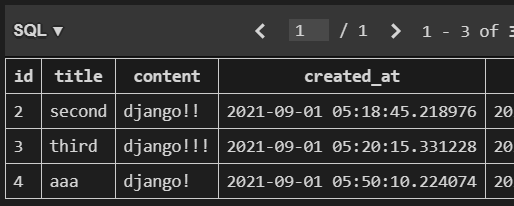

### 목차

- [Django 2](#django-2)
  * [Django Model](#django-model)
    + [Model](#model)
    + [Database](#database)
    + [Database의 기본 구조](#database의-기본-구조)
  * [ORM (Object Relational Mapping)](#orm-object-relational-mapping)
    + [models.py 작성](#modelspy-작성)
  * [Migrations](#migrations)
    + [DataField's options(주의!)](#datafields-options주의s)
    + [반드시 기억해야 할 migration 3단계](#반드시-기억해야-할-migration-3단계)
  * [Database API](#database-api)
  * [CRUD](#crud)
    + [CREATE](#create)
    + [READ](#read)
    + [UPDATE](#update)
    + [DELETE](#delete)
  * [CRUD with views](#crud-with-views)
    + [HTTP method](#http-method)

<br>

# Django 2

<br>

## Django Model

### Model

- 단일한 데이터에 대한 정보를 가짐 (사용자가 저장하는 데이터들의 필수적인 필드들과 동작들을 포함)

- 장고는 모델을 통해 데이터에 접속하고 관리

- 일반적으로 각각의 model은 하나의 DB 테이블에 매핑됨

  **모델 != 데이터베이스**

---

### Database

- DB: 체계화된 데이터의 모임

  `sqlite`: 가장 간단한, file 형태의 DB. 다른 DB는 서버 형태로 on/off하며 돌아감.

- 쿼리: 조건에 맞는 데이터를 조회/조작하는 명령어


### Database의 기본 구조

- 스키마: 데이터베이스의 전체적인 구조 (DB의 정의)

- 테이블: 열(=필드) & 행(=레코드) 모델을 사용해 조작된 데이터 요소들의 집합 (실제 저장되어 있는 형태)

  SQL 데이터베이스에서는 Relation이라고도 함

  하나의 DB에 여러 개의 테이블이 들어감

- PK(기본키, Primary Key): 각 행의 고유값. 반드시 설정해야 함. DB 관리 및 관계 설정 시 주요하게 활용

<br>

## ORM (Object Relational Mapping)

- 객체지향 형태로 SQL 문법을 편하게 사용하기 위한 문법! SQL문을 직접 작성하는 게 아니라, SQL문을 작성할 수 있는 형태의...?
- 객체 지향 프로그래밍 언어를 사용하여, 호환되지 않는 유형의 시스템 간에(Django - SQL) 데이터를 **변환**하는 프로그래밍 기술
- OOP 프로그래밍에서 RDBMS을 연동할 때, 데이터베이스와 객체 지향 프로그래밍 언어 간의 호환되지 않는 데이터를 변환하는 프로그래밍 기법 (장고는 RDBMS 사용)
- 내장되어 있는 경우가 많음. Django는 내장 Django ORM 사용


- 장점: SQL을 잘 알지 못해도 DB 조작 가능

- 단점: ORM 만으로 완전한 서비스를 구현하기 어려운 경우가 있음

- 왜 ORM을 사용할까?

  -> DB를 객체로 조작하기 위해! (**생산성**)

---

### models.py 작성

- 앱 별로 `models.py` 작성

- 사용 모델 필드
  - `CharField(max_length=None)`: 길이 제한이 있는 문자열을 넣을 때 사용
  - `TextField()`: 글자수가 많을 때 사용

<br>

## Migrations

- django가 model에 생긴 변화를 DB에 반영하는 방법

- Migration 실행 및 DB 스키마를 다루기 위한 몇 가지 명령어

  1. `makemigrations` (중요!!!)

     ```shell
     $ python manage.py makemigrations
     ```

     : models를 DB로 보내줄 수 있도록 migrations(설계도) 만들 때 사용

     -> ORM이 내가 만든 설계도를 보고 SQL로 바꿔서 DB에게 전달

     (현재 DB는 비어있는 상태)

     모델에 변경사항 발생 시 makemigrations 하면 옵션 선택 뜸 (장고가 기본값 넣어주기 or 내가 기본값 넣기) -> 엔터 누르면 그대로 만들어 줄게! -> 완료

  2. `migrate` (중요!!!)

     ```shell
     $ python manage.py migrate
     ```

     : 설계도를 실제 DB에 반영하는 과정(설계도가 있어야 동작!)

     처음 migrate할 땐 INSTALLED_APPS에 있는 기본 앱들도 migrate 되기 때문에 줄줄이 뜨는 것

     `앱이름_클래스이름` 으로 테이블이 만들어짐

  3. `sqlmigrate`

     ```shell
     $ python manage.py sqlmigrate articles 0001
     ```

     이런 식으로 뒤에 앱 이름, 번호 작성

     마이그레이션이 SQL문으로 어떻게 해석되어 동작할 지 미리 확인 가능

  4. `showmigrations`

     ```shell
     $ python manage.py showmigrations
     ```

     적용이 안 되어 있으면 `[ ]` 이렇게 빈 칸!

### DataField's options(주의!)

- `auto_now_add`

  : 최초 insert 시에만 현재 날짜, 시간 저장

- `auto_now`

  : 장고 ORM이 save를 할 때마다 현재 날짜, 시간으로 갱신

### 반드시 기억해야 할 migration 3단계

1. `models.py`

   : model 변경사항 발생 시

2. `python manage.py makemigrations`

   : migration 파일 생성

3. `python manage.py migrate`

   : DB 반영


- 어제의 중요 내용

  : url -> views -> template

<br>

## Database API

- DB API

  - db를 조작하기 위한 도구. 파이썬으로 객체지향적으로 작성
  - 모델을 만들면 장고는 객체들을 CRUD 할 수 있는 database-abstract API를 자동으로 만듦
  - database-abstract API 혹은 database-access API 라고도 함
  - ORM에 관한 문법을 의미!


- DB API 구문

  ```python
  Article.objects.all()
  ```

  : article 클래스의 모든 object를 조회 -> 전체 게시글을 달라!

  - `Article`: Class Name

  - `objects`: Manager

    기본적으로 모든 장고 모델 클래스에 objects라는 manager를 추가

  - `.all()`: QuerySet API

    데이터베이스로부터 전달받은 객체 목록

    queryset 안의 객체는 0개/1개/여러 개 일 수 있음
  
    데이터베이스로부터 조회, 필터, 정렬 등을 수행할 수 있음(리스트처럼 되어 있어서?)


> 환경 맞춰주기
>
> `pip freeze > requirements.txt`
>
> `pip install -r requirements.txt`

<br>

## CRUD

### CREATE

```shell
# 라이브러리 설치해야 shell_plus 동작함
$ pip install ipython 
$ pip install django-extensions

# INSTALLED_APPS에 'django_extensions' 등록 후 실행
$ python manage.py shell_plus

##########################################
# CREATE 방법 1: 인스턴스 변수에 하나씩 값 넣어줌

# 테이블에 새 레코드(게시글) 추가: 인스턴스 생성
article = Article()
# 인스턴스 변수 값 설정
article.title = 'first'
article.content = 'django!'
# DB에 진짜로 레코드가 작성되려면 save() 메서드 호출해야 함
article.save()
# 전체 게시글 조회해보면 쿼리셋에 데이터 들어있음
Article.objects.all()

# 둘 다 같은 결과가 나오지만 장고에서는 pk 사용 권장!
article.id
article.pk

############################################
# CREATE 방법 2: 초기값과 함께 인스턴스 생성 후 저장 => 이 방법 사용!

article = Article(title='second', content='django!!')
article.save()

############################################
# CREATE 방법 3: 바로 객체 생성에 저장까지!

Article.objects.create(title='third', content='django!!!')
```

```python
class Article(models.Model):
    title = models.CharField(max_length=10)
    ...
    
    def __str__(self):
        # 이 부분은 설계도에서 수정한 것이므로 migration 안 해도 됨!
        return self.title
```

### READ

- `all()`

  - 리스트처럼 생긴 쿼리셋(현재 쿼리셋의 복사본) 반환

- `get()`

  - 주어진 lookup 매개변수와 일치하는 객체 반환

  - 객체를 찾을 수 없으면 DoesNotExist 예외 발생시킴

    둘 이상의 객체를 찾으면 MultipleObjectReturned 예외 발생시킴

    -> **객체가 1개일 때만** 예외 발생 X -> 고유성을 보장하는 조회에서 사용해야 함 -> unique? id(pk)!

- `filter()`

  - 주어진 lookup 매개변수와 일치하는 객체를 포함하는 새 쿼리셋 반환

    -> pk가 아닐 때 사용
    
  - ex) `Article.objects.filter(pk__gt=2)` : greater than 2

    `Article.objects.filter(content__contains=='ja')`

### UPDATE

```shell
# 우선 수정하려면, 해당 글을 가져와야 함
article = Article.objects.get(pk=1)

article.title = 'byebye'

article.save()
# 이 때 created_at은 바뀌지 않고 updated_at은 바뀜!
```

### DELETE

- CRUD 중에 가장 간단한 과정

```shell
article = Article.objects.get(pk=1)

# 삭제되면서 반환값이 있음!
article.delete()

Article.objects.all()
# 삭제된 것 확인 가능
```

- 장고에서는 DB에서 삭제된 것을 재사용하지 않음



+) view가 몇 개 필요할까?

1. 게시글 작성 페이지를 render하는 view
2. 사용자로부터 입력받은 데이터를 저장하는 view

<br>


## CRUD with views
### HTTP method

- GET

  - 반드시 **데이터를 가져올 때**만 사용해야 함
  - DB에 변화를 주지 않음. 가져오기만 하는 거니까
  - CRUD에서 R 역할을 담당
  - 그런데 우리는 방금 게시글 작성 = create. DB에 영향을 주는 행동을 하는 건데 get 방식을 썼음. 글 작성은 되지만 올바른 행동은 아님! 그렇다면 다른 방식이 뭐가 있을까?

- POST

  - **서버로 데이터를 전송할 때** 사용

  - 리소스를 생성/변경하기 위해 데이터를 (Form data로) HTTP body에 담아 전송(url에 드러나지 않음)
  - CRUD에서 C/U/D 역할을 담당
  - 그러면 검색 기능은 왜 get일까? 검색했다고 해서 DB에 무언가가 변하는 건 아니기 때문.
  - 그런데 form에서 csrf_token 없이 POST로 바꿔서 submit 하면 CSRF 에러 발생


- 사이트 간 요청 위조 (CSRF: Cross-site request forgery)

  - 사용자가 자신의 의지와 무관하게 공격자가 의도한 행동을 하여 특정 웹페이지를 보안에 취약하게 하거나 수정, 삭제 등의 작업을 하게 만드는 공격 기법

  - 장고는 CSRF에 대항하여 middleware와 template tag 제공

    -> 장고가 렌더링한 템플릿 맞다고 매 요청마다 렌더링하는 순간에 뭔가를 하나 더 보내줌: Hash Data (`csrf token`)


+) models 파일이 없어도 장고가 갖고있는 기본 migrate 파일 있어서..? migrate 명령어 입력하면 뭐가 주루룩 뜨기는 함. 근데 admin 계정 만들 때는 migration 필요.


+) 서비스를 만들 때 가장 먼저 작성해야 하는 게 `models.py` 그 다음에 urls views templates

