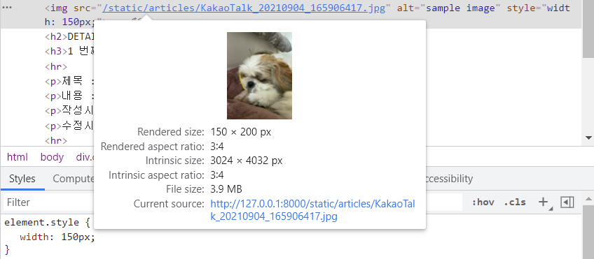
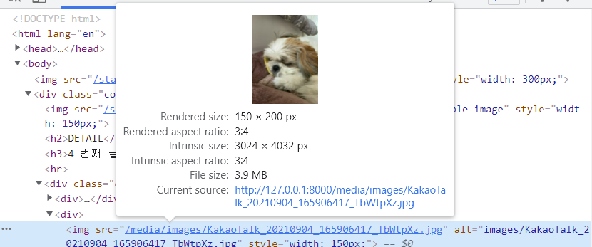

### 목차

- [Django 4 - Managing Static Files](#django-4---managing-static-files)
  * [Static files](#static-files)
    + [Static file](#static-file)
    + [Static file 구성](#static-file-)
    + [Django template tag](#django-template-tag)
    + [The staticfiles app](#the-staticfiles-app)
    + [정적 파일 사용하기](#--)
  * [이미지 업로드(기본 설정)](#---1)
    + [이미지 업로드](#-)
    + [Model field](#model-field)
  * [이미지 업로드(READ)](#-read)
    + [사용자가 업로드 한 파일 제공하기](#----)
  * [이미지 업로드(CREATE)](#-create)
  * [이미지 업로드(READ)](#-read-1)
  * [이미지 업로드(UPDATE)](#-update)
  * [이미지 Resizing](#-resizing)

<br>

# Django 4 - Managing Static Files

## Static files

### Static file

- 정적 파일. 응답할 때 별도의 처리 없이 파일 내용을 그대로 보여주면 되는 파일
- 장고에서는 이러한 파일들을 "static file"이라고 함

### Static file 구성

1. `djangocontrib.staticfles`가 INSTALLED_APPS에 포함되어 있는지 확인

2. settings.py에서 STATIC_URL 정의

3. 템플릿에서 static 템플릿 태그를 사용해 지정된 상대경로에 대한 URL 빌드

   ```django
   
   
   
   ```

4. 앱의 static 폴더에 정적 파일 저장 -> templates 폴더 만들 때와 같은 구조로!

### Django template tag

- `load`

  : 사용자 정의 템플릿 태그 세트를 로드

- `static`

  : STATIC_ROOT에 저장된 정적 파일에 연결

### The staticfiles app

- `STATIC_ROOT`

  - collectstatic이 배포를 위해 정적 파일을 수집하는 디렉토리의 절대 경로

    -> 지금은 배포할 게 아니므로 작성하지 않아도 됨

  - django 프로젝트에서 사용하는 모든 정적 파일을 *한 곳에* 모아 넣는 경로

  - 개발 과정에서 settings.py의 `DEBUG = True`인 경우 적용되지 않음

    => 직접 작성하지 않으면 django 프로젝트에서는 settings.py에 작성되어 있지 않음

  - 실 서비스 환경에서 장고의 모든 정적 파일을 다른 웹 서버가 직접 제공하기 위함

  +) collectstatic: 배포를 위해 img, css, js 등 static 파일들을 모아오는 것

  ```python
  # settings.py
  STATIC_ROOT = BASE_DIR / 'staticfiles'
  ```

  ```shell
  # shell
  $ python manage.py collectstatic
  ```

  => 이렇게 하면 BASE_DIR 위치에 해당 이름(ex. staticfiles)으로 된 폴더 생성됨

- `STATIC_URL`

  ```python
  STATIC_URL = '/static/'
  ```
  
  - STATIC_ROOT에 있는 정적 파일을 참조할 때 사용할 URL -> 이 경로가 템플릿에서 static 태그와 사용됨?
    - 개발 단계에서는 실제 정적 파일들이 저장되어 있는 app/static/ 경로 (기본 경로) 및 `STATICFILES_DIRS`에 정의된 추가 경로들을 탐색함
  - 실제 파일이나 디렉토리가 아님! URL로만 존재
  - 비어 있지 않은 값으로 설정한다면(=빈 문자열이 아닌 이상) 반드시 slash로 끝나야 함


- `STATICFILES_DIRS`

  ```python
  STATICFILES_DIRS = [
      BASE_DIR / 'static',
  ]
  ```

  - app/static/ 디렉토리 경로 사용(기본 경로) 외에 추가적인 정적 파일 경로 목록을 정의하는 리스트 -> `BASE_DIR`처럼!
  - 기본 경로 외에 추가적인 정적 파일 경로 목록 정의 -> 정적 파일을 찾아볼 위치들 정의

### 정적 파일 사용하기

1. 기본 경로

   정적 파일 경로: app명/static/app명

   ```django
   articles/detail.html
   
   
   
   articles/static부터 경로 시작 -> 앱이름 폴더/파일명
   
   ```

2. 추가 경로

   STATICFILES_DIR에서 작성한 추가 경로

   ```python
   # settings.py
   
   STATICFILES_DIRS = [
       BASE_DIR / 'static',
   ]
   ```

   ```django
   base.html
   
   
   
   BASE_DIR의 static부터 경로 시작
   
   ```

3. STATIC_URL 확인

   - detail 페이지 얻으려면 ~/articles/pk/ 로 요청. 이미지도 얻으려면 이미지에 대한 주소로 요청 보내야 함. 그게 static url이 만들어주는 주소.

     -> 기본 경로/static/내가 작성한 img src

   

<br>

## 이미지 업로드(기본 설정)

### 이미지 업로드

- Media file
  - 미디어 파일. 사용자가 웹에서 업로드하는 모든 정적 파일

### Model field

- `ImageField`

  - 이미지 업로드에 사용하는 모델 필드
  - FileField를 상속받는 서브 클래스
  - **사용하려면 반드시 `pip install Pillow` 필요!**
  - `blank=True`: *form 유효성 검사에서* 빈 값이어도 통과 가능. DB에는 ''(빈 문자열) 저장됨
    - `null=True`: 빈 값을 *DB에* NULL로 저장. 문자열 기반 필드에는 사용하는 것을 피해야 함! (이 부분 헷갈림!!!!)

- `FileField`

  - 파일 업로드에 사용하는 모델 필드

  - 선택인자 `upload_to`: 실제 파일이 저장되는 경로 지정

    - 업로드 디렉토리, 파일 이름 설정 방법

      1. 문자열 경로 지정 방식

         ```python
         image = models.FileField(upload_to='uploads/')
         image = models.FileField(upload_to='uploads/%Y/%m/%d/')
         ```

      2. 함수 호출 방식: 반드시 2개의 인자(instance, filename) 사용

         ```python
         def articles_image_path(instance, filename):
             return f'user_{instance.pk}/{filename}'
             # 저장되기 전이니까(pk 없으니까) user_None이라는 폴더로 만들어짐
             # 저장 이후 수정할 때 시점에는 None이 아님 -> pk값 사용 가능
         
         # Create your models here.
         class Article(models.Model):
             # ...
             image = models.ImageField(upload_to=articles_image_path, blank=True)
         ```

<br>

## 이미지 업로드(READ)

- ImageFiled(or FileField)를 사용하기 위한 몇 가지 단계

  1. settings.py에 MEDIA_ROOT, MEDIA_URL 설정
  
  2. upload_to 속성을 정의하여 업로드 된 파일에 사용할 MEDIA_ROOT의 하위 경로 지정

  3. 업로드 된 파일의 경로는 django가 제공하는 'url' 속성을 통해 얻을 수 있음

     ```python
     
     ```
  
- `MEDIA_ROOT`

  ```python
  MEDIA_ROOT = BASE_DIR / 'media'
  ```

  - 사용자가 업로드한 파일들을 보관할 디렉토리의 절대 경로
  - 장고는 업로드 파일을 DB에 저장하지 않음. **파일의 경로를 저장**!!!!
  - MEDIA_ROOT는 STATIC_ROOT와 다른 경로로 지정해야 함

- `MEDIA_URL`

  ```python
  MEDIA_URL = '/media/'
  ```

  - MEDIA_ROOT에서 제공되는 미디어를 처리하는 URL
  - 업로드 된 파일의 주소를 만들어 주는 역할
  - 비어 있지 않은 값으로 설정 시 `/`로 끝나야 함
  - MEDIA_URL은 STATIC_URL과 다른 경로로 지정해야 함

  

### 사용자가 업로드 한 파일 제공하기

```python
# crud/urls.py

from django.contrib import admin
from django.urls import path, include
from django.conf import settings
from django.conf.urls.static import static

urlpatterns = [
    path('admin/', admin.site.urls),
    path('articles/', include('articles.urls')),
] + static(settings.MEDIA_URL, document_root=settings.MEDIA_ROOT)

# 업로드된 이미지가 없습니다 문제 해결
# 사용자가 업로드한 파일이 DB에 저장은 되었으나, 실제로 사용자에게 제공하기 위해서는 업로드 된 파일의 URL 필요
# 업로드 된 파일의 URL => settings.MEDIA_URL
# URL을 통해 참조하는 파일의 실제 위치 => settings.MEDIA_ROOT
```

<br>

## 이미지 업로드(CREATE)

- ImageField를 사용하기 위해 Pillow 라이브러리 설치

  ```shell
  $ pip install Pillow
  ```

- form : enctype 속성 지정

  - 파일/이미지 업로드 시 반드시 사용(전송되는 데이터의 형식 지정)
  - `<input type="file">`을 사용할 경우 사용

  ```django
  articles/create.html
  
  <form action="" method="POST" enctype="multipart/form-data">
      
      {{ form.as_p }}
      <button>작성</button>
  </form>
  ```

- input 요소: accept 속성

  - 입력을 허용할 파일 유형을 나타냄
  - 파일 검증을 하는 것은 아니고, 업로드 시 보이는 창에서 해당 파일 형식에 대해 필터링

- Views.py 수정

  ```python
  def create(request):
      if request.method == 'POST':
          # data=request.POST, files=request.FILES
          form = ArticleForm(request.POST, request.FILES)
          # ...
  ```


- 함수 호출 방식

  instance.user.pk 폴더 안에 filename 이름으로 업로드

  그리고 이걸 upload_to에 넣음

<br>

## 이미지 업로드(READ)

- 이미지 경로 불러오기

  ```django
  articles/detail.html
  
  
  
  	<h2>DETAIL</h2>
  	<h3>{{ article.title }}</h3>
  	
  
  ```

## 이미지 업로드(UPDATE)

- 이미지 수정하기

  - 이미지는 바이너리 데이터 -> 텍스트처럼 일부 수정하는 것은 불가능
  - 새로운 사진으로 덮어 씌우는 방식 사용

  1. update.html의 form에서 enctype 지정
  2. views.py에서 update 함수에 request.FILES 작성
  3. detail.html에서 img src, alt 작성

<br>

## 이미지 Resizing

- 이미지 크기 변경하기
  - 실제 원본 이미지를 서버에 그대로 업로드 하는 것은 서버의 부담이 큰 작업
  - `` 태그에서 width, height로 직접 사이즈 조정할 수도 있지만, 업로드 될 때 이미지 자체를 resizing하는 것을 사용해 볼 것
  - django-imagekit 라이브러리 활용!
  
    1. `pip install django-imagekit`
    2. INSTALLED_APPS에 `imagekit` 추가
  

<br>

---

<br>

- 내가 정리한 내용

  ```python
  STATIC_URL = '/static/'
  
  # 여기서 STATICFILES_DIRS라고 해야 하는데 DIR이라고 써서 static 파일들 불러올 때 404 에러 났었음!!!!
  # static 파일들 사용할 때
  # 1. 파일들 불러올 경로 작성 (STATICFILES_DIRS)
  # 2. 해당 경로에 파일들 저장
  # 3. 템플릿에서 load static 한 뒤 이미지 src 작성
  STATICFILES_DIRS = [
      BASE_DIR / 'static',
  ]
  
  MEDIA_URL = '/media/'
  
  MEDIA_ROOT = BASE_DIR / 'media'
  # 사용자 입력 파일 사용할 때
  # 1. 여기서 MEDIA_URL, MEDIA_ROOT 작성
  # 2. models.py에서 ImageField 작성 & pip install Pillow
  image = models.ImageField(upload_to='uploads/', blank=True)
  # 3. 파일 업로드를 위해 템플릿의 form태그에서 enctype 작성
  <form action="" method="POST" enctype="multipart/form-data">
  # 4. DB에 저장하기 위해 views.py에서 form의 인자로 request.FILES를 줌
  def create(request):
      if request.method == 'POST':
          # data=request.POST, files=request.FILES
          form = ArticleForm(request.POST, request.FILES)
          # ...
  # 5. 화면에 보여주기 위해 urls.py에 + static 작성 & 템플릿에서 movie.image.url 사용
  urlpatterns = [
      path('admin/', admin.site.urls),
      path('articles/', include('articles.urls')),
  ] + static(settings.MEDIA_URL, document_root=settings.MEDIA_ROOT)
  
  
  
  # Default primary key field type
  # https://docs.djangoproject.com/en/3.2/ref/settings/#default-auto-field
  
  ```
  
  

+) 오늘 오전 핵심 내용

`request.FILES`

``

settings.py에 `STATIC_URL` ~ `MEDIA_URL`

- URL: 장고가 리소스를 참조하기 위한 주소

  DIR: 실제 파일 경로

- STATIC: 개발자가 미리 준비하는 파일

  MEDIA: 사용자가 올릴 예정

- `STATIC_URL`, `STATICFILES_DIRS`: 장고 프로젝트 작성 시 미리 준비하는 경로와 주소

  여기에 있는 경로 참고해서 모델에서.. 어쩌구 주소 준비

- `MEDIA_ROOT`, `MEDIA_URL`: 사용자로부터 받을 예정인 실제 저장될 파일 경로, 리소스 참조 주소

