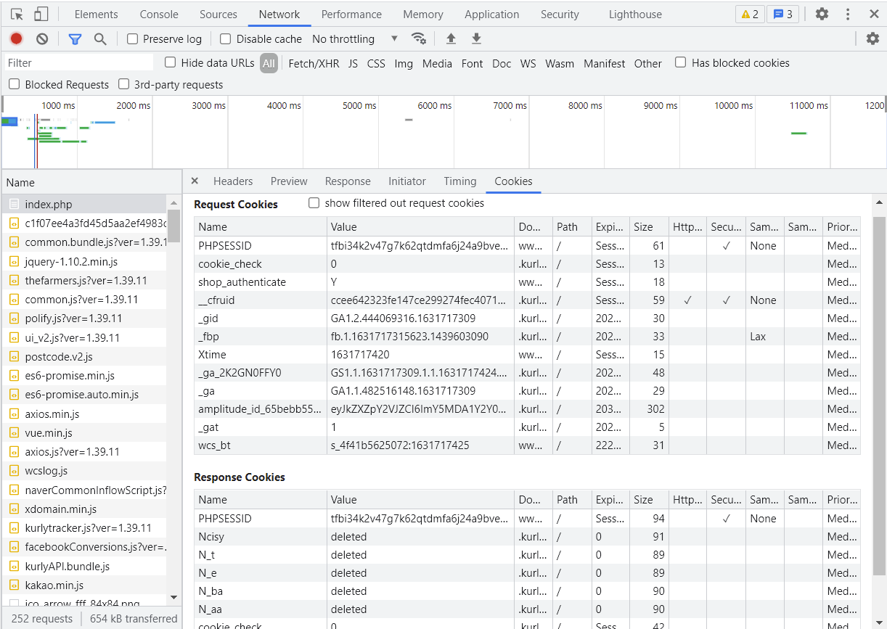
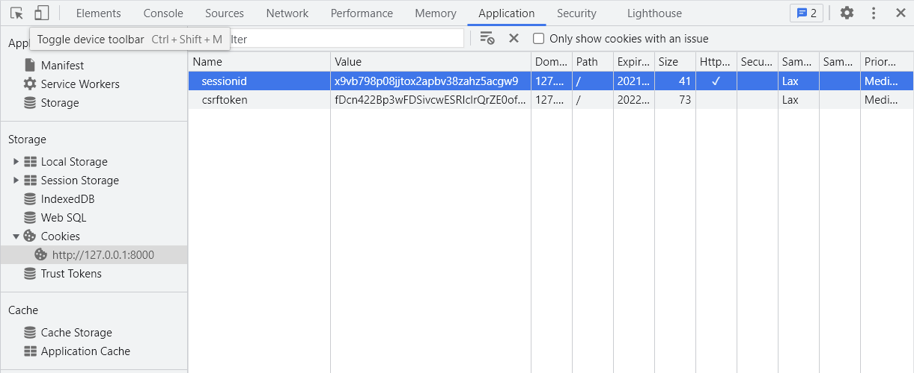

### 목차

- [Django 05](#django-05)
- [Django Authentication System 1](#django-authentication-system-1)
  * [The Django Authentication System](#the-django-authentication-system)
    + [Authentication & Authorization](#authentication--authorization)
  * [쿠키와 세션](#-)
    + [HTTP](#http)
    + [쿠키](#)
    + [세션](#-1)
    + [쿠키 lifetime](#-lifetime)
    + [Session in Django](#session-in-django)
    + [Authentication System in MIDDLEWARE](#authentication-system-in-middleware)
  * [LOGIN](#login)
    + [AuthenticationForm](#authenticationform)
    + [login 함수](#login-)
  * [Authentication data in templates](#authentication-data-in-templates)
  * [LOGOUT](#logout)
  * [로그인 사용자에 대한 접근 제한](#----)
- [Django Authentication System 2](#django-authentication-system-2)
    + [회원가입](#-2)
    + [회원탈퇴](#-3)
    + [회원정보 수정](#--1)
    + [비밀번호 변경](#--2)

 

# Django 05

# Django Authentication System 1

프레임워크를 사용하면서 장점은 개발자가 좀 디테일한 부분들, 사용자 경험을 고려할 수 있다는 것!

## The Django Authentication System

- django 인증 시스템의 필수 구성은 이미 settings.py에 포함되어 있음
  
  - `django.contrib.auth`
  - `django.contrib.contenttypes`
  
- django 인증 시스템은 **인증**과 **권한** 부여를 함께 제공(처리)

  -> 이러한 기능이 어느 정도 결합되어 일반적으로 인증 시스템이라고 함

### Authentication & Authorization

- Authentication(인증)

  - 신원 확인: 누구세요?

  - 사용자가 자신이 누구인지 확인하는 것
- Authorization(권한, 허가)

  - 권한 부여: 누군지는 알겠는데, 권한 있어?
- 인증된 사용자가 수행할 수 있는 작업 결정

 

## 쿠키와 세션

큰 특징: 요청이 들어왔을 때 응답 **쿠키 자리에 session id를** 넣어주고, 그걸 **DB에 저장**하고 있음

### HTTP

- Hyper Text Transfer Protocol

- 웹 상에서 주고 받는 데이터들을 가져올 수 있도록 해주는 규약

  - 이 안에 쿠키는 이렇게, 세션은 이렇게 담아야 한다~ 되어 있음?

- 웹에서 이뤄지는 모든 데이터 교환의 기초(결국은 요청과 응답에 대한 것)

- 특징 **(중요!)**

  - 비연결지향
    - 서버는 요청에 대한 응답을 보낸 후 연결을 끊음(계속 손을 잡고있는 게 아님)
    - 주고 끝. 받고 끝.
  - 무상태
    - 연결을 끊는 순간 클라이언트-서버 간의 통신이 끝나며 상태 정보가 유지되지 않음
    - 클라이언트와 서버가 주고 받는 메시지들은 서로 완전히 독립적
  
  => 비연결지향으로 인해 무상태의 특징을 갖게 되고, 무상태가 되면 상태 정보(ex. 로그인 상태)가 유지되지 않음
  
  => 지속적인 상태 유지를 위해 쿠키&세션(인증마크)이 존재

### 쿠키

- 서버가 사용자의 웹 브라우저에 전송하는 작은 데이터 조각

- 소프트웨어가 아니라서 악성코드를 설치할 수는 없지만, 사용자의 행동을 추적하거나 쿠키를 훔쳐서 해당 사용자의 계정 접근권한을 획득할 수 있음. 탈취했을 경우 문제가 되는 것.

- 쿠키는 상태가 있는 세션을 만들어 줌. 이를 이용해 사용자의 로그인 상태를 유지할 수 있음. 매번 요청마다 로그인이 되었다는 정보를 보냄. 상태가 없는 HTTP 프로토콜에서 상태 정보를 기억시켜주기 때문!

- 웹 페이지에 접속하면, 요청한 웹 페이지를 받으며 쿠키를 저장하고, 클라이언트가 같은 서버에 재요청 시 요청과 함께 쿠키도 전송

  
  
  ex) 장바구니에 담은 정보가 계속되는 이유는 '장바구니 다우니' 하고 계~속 쿠키를 보내기 때문!
  
  :small_red_triangle: TIL: 마켓컬리 홈페이지에서 개발자 도구를 보려고 하니 우클릭 방지가 되어 있었음. F12 + F1 단축키를 활용해 쿠키 확인!
  
  
  
  - sessionid와 DB의 session_key를 비교

### 세션

- 쿠키 중에서도 상태를 유지시키는 데 사용되는 것들
- 상태는 끊어져 있지만, 상태를 유지하는 것처럼 만들어주는 게 세션
- 장고에서 사용하는 쿠키-세션 방식의 큰 특징! 클라이언트가 서버에 접속하면서 서버로부터 session id가 발급되면서 쿠키에 저장됨. 그리고 동시에 서버(정확히는 DB)에서도 session id를 갖고 있게 됨. 쿠키는 요청 때마다 서버에 함께 전송되므로 서버에서 session id를 확인해 알맞은 로직을 처리

### 쿠키 lifetime

: 인증마크에 기한도 정해주는 것

- Session cookies
  - 브라우저가 현재 세션이 종료되는 시기를 정의. 이 시기가 오면 삭제됨
- Persistent cookies (or Permanent cookies)
  - Expires/Max-Age 속성에 지정된 날짜/기간이 지나면 삭제

### Session in Django

- django의 세션은 미들웨어를 통해 구현됨

  -> 구현할 필요 없이 사용 가능. 그래도 알긴 알아야 함 (sql 몰라도 orm 사용할 순 있지만 sql 알아야 하는 것처럼)

- 세션 정보는 Django DB의 `django_session` **테이블에** 저장됨

  -> 모든 것을 세션으로 사용하려고 하면 DB에 INSERT 동작이 계속 일어남. 사용자가 많을 때 서버에 부하가 걸릴 수 있음

  -> 오늘날에는 쿠키-세션과 토큰을 혼용하기도, DB에 저장하지 않기도 함

### Authentication System in MIDDLEWARE

이미 많이 구현되어 있어서 따로 건드릴 건 없음

- MIDDLEWARE
  - http 요청과 응답 처리 중간에서 작동하는 시스템. 요청/응답은 미들웨어를 거쳐서 들어오거나 나감
  - 주로 데이터 관리, 애플리케이션 서비스, 인증 및 API 관리 담당

 

## LOGIN

- session을 create 하는 로직과 같음
- 인증에 관한 built-in forms 제공
  - 유효성 검사도 편리하게 할 수 있음(비밀번호 패턴 검사 등)

### AuthenticationForm

- 로그인 과정에 사용되는 form
- request를 첫번째 인자로 취함

### login 함수

`login(request, user, backend=None)`

- 세션에 user의 ID를 저장(==로그인)

  -> save()를 통해 DB에 반영
  
- **views.py의 login 함수와 namespace가 겹치므로 as를 이용해 auth_login으로 이름 변경**

 

## Authentication data in templates

- Users

  - 템플릿 RequestContext?를 렌더링할 때, 현재 로그인한 사용자를 나타내는 auth.User 인스턴스(또는 AnonymousUser 인스턴스)는 템플릿 변수 **`{{ user }}`**에 저장됨

    -> 이미 settings.py에 들어있기 때문에 user 같이 그냥 바로 사용할 수 있는 것

 

## LOGOUT

- session을 delete 하는 로직과 같음

  -> 회원정보를 관리하는 게 아니라 세션에 관한 것. 로그인 체크. 이 사람이 있는지 없는지만 알면 되므로 세션에서 update는 필요 없음. 비밀번호 변경(update)은 회원정보 변경에 속함

- `logout(request)`
  - 로그인하지 않더라도 로그아웃은 시도할 수 있음
  - 현재 요청에 대한 데이터를 DB에서 삭제하는 역할. 동시에 클라이언트의 쿠키에서도 session id 삭제됨

 

## 로그인 사용자에 대한 접근 제한

- 로그인 사용자에 대한 액세스 제한 방법 2가지

  1. The raw way: `is_authenticated` attribute
  2. The `login-required` decorator

- is_authenticated

  - True/False 반환 -> 조건문 형태로 사용
  - 일반적으로 request.user에서 이 속성을 사용 ex) `if request.user.is_authenticated:`
  - 단, 권한(permission)과는 관련 없음. 그냥 user가 한 번이라도 인증을 받은 사람인지를 검사
  - 이미 로그인 상태의 사용자라면 로그인 로직 수행할 수 없게, 로그인 상태의 사용자만 로그아웃 로직 수행할 수 있게 처리하거나 로그인 여부에 따라 화면 다르게 보여주는 데 사용!

- login_required

  - 사용자가 로그인되어 있지 않으면, LOGIN_URL에 설정된 경로(기본값: '`/accounts/login/`')로 redirect 

  - 다음 방문할 페이지에 대한 정보를 url에 담아줌 (UX 향상!)

    ex) `/accounts/login/?next=/articles/create/`
  
  - views의 login 함수에서 이에 대한 처리를 해주어야 로그인 후 next로 이동
  
  - login template에서도 form의 action값을 비워줘야 현재 url로 요청 보낼 수 있음
  
    -> 유저로 하여금 내가 하고 있는 행동이 이어진다고 느끼게 해줌
  
    -> OAuth: 회원가입 창에서 작성해야 하는 것들이 많아지면 이탈율이 높아짐. 그래서 소셜 로그인 등을 통해 버튼 하나로 가입할 수 있게 해준다! 그리고 이 사람의 아이디/비밀번호를 내가 갖고 있을 필요 없이 위탁할 수 있음. 근데 그렇게 간단하지 않고 이걸 구현하고, token을 관리하고..하는 것들도 공부를 해야 함

- `@login_required` & `@require_POST`

  - 함께 사용하는 경우 에러 발생 -> login_required에서 걸리면 로그인 함수로 가서 로그인한 뒤 redirect 되는데 redirect에서는 무조건 GET 방식으로 요청하므로 require_POST에서 에러가 남

  - 둘 중 하나만 사용하고 나머지 하나에 대해서는 함수 내에서 if문으로 처리!

 

# Django Authentication System 2

### 회원가입

- `UserCreationForm`
  - 3개의 필드를 가짐
    1. username
    2. password1
    3. password2

### 회원탈퇴

- `is_authenticated()`

  : delete() 함수에서도 authenticated이면 delete 할 수 있게

  True/False 반환. 유저가 Anonymous일 때 False 반환(비어있는 게 아니라 anonymous user라고 하는 게 더 정확)

- `logout(request)` -> `auth_logout(request)`

  : session 테이블에서 session id 삭제

### 회원정보 수정

- `UserChangeForm`

  : 그냥 가져다 쓰면 사용자가 보면 안 될 내용까지 수정할 수 있게 뜸 -> 상속받아서 forms.py에서 커스텀

  유저모델을 어디선가 직접 가져오는 게 아니라 유저 모델을 불러오는 함수를 실행(`get_user_model()`) -> 이렇게 하는 걸 장고에서 권장. User도 커스텀 할 수 있기 때문. 이렇게 하면 커스텀 된 유저도 그대로 반영해서 가져올 수 있음

### 비밀번호 변경

- `PasswordChangeForm`

  : 폼 글자 클릭하면비밀번호 변경 페이지가 별도로 존재. a 태그에 `accounts/password/`로 경로가 쓰여있음. 장고가 accounts를 자동으로 사용하고 있으므로 accounts 앱이름 사용 권장!

  해당 url로 들어왔을 때 trigger 함수는 우리가 구성

  첫 인자가 user인 이유는 생성자 맨 앞에 user가 나와서

- `update_session_auth_hash(request, user)`

  : 비밀번호가 바뀌면 session hash도 달라짐->로그인 상태 유지 x

  비밀번호 바꾼 뒤 다음 동작을 어떻게 할 지(로그인 유지 할/말)에 따라 사용 할/말

---

별도의 테이블이 존재!

- 세션 정보 테이블

  - C: 로그인

  - D: 로그아웃

- 회원 정보 테이블

  - C: 회원가입

  - R: 회원 정보 조회

  - U: 회원 정보 수정(일반/pw)

  - D: 회원 탈퇴

