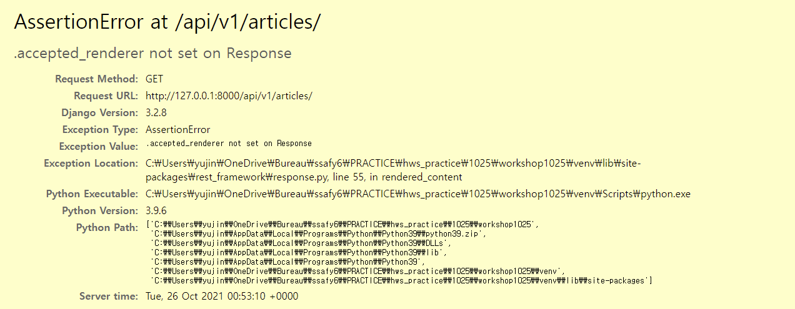

### 목차

- [Django 06: Rest API](#django-06-rest-api)
  * [HTTP](#http)
  * [RESTful API](#restful-api)
  * [Response](#response)
  * [Single Model](#single-model)
  * [1:N Relation](#1n-relation)

<br>

# Django 06: Rest API

- seed 넣는 법

  ```shell
  # migration 작업 후
  python manage.py seed articles --number=20
  ```

- 문서가 아니라 하나의 json 데이터를 전달!

<br>

## HTTP

- HTTP

  - HyperText Transfer Protocol

  - 웹 상에서 컨텐츠를 주고 받기 위한 약속

  - 기본 특성: **Stateless, Connectless**

    -> 쿠키와 세션을 통해 서버 상태를 요청&연결하도록 함

- HTTP request methods

  - 자원에 대한 *행위*(수행하고자 하는 동작)를 정의

  - 주어진 리소스(URI)에 수행하길 원하는 *행동*을 나타냄
  - 더 이상 form 시스템에 얽매이지 않고 template 사용하게 되면서 GET, POST, PUT, DELETE(CRUD) 네 가지 메서드 사용할 수 있게 확장됨

- HTTP response status codes

  - 특정 HTTP 요청이 성공적으로 완료되었는지 여부를 나타냄

  1. Informational responses (1xx)
  2. Successful responses (2xx)
  3. Redirection messages (3xx)
  4. Client error responses (4xx) -> 이게 제일 문제
  5. Server error responses (5xx)

- 웹에서의 리소스 식별

  - HTTP 요청의 대상: 리소스(문서, 사진.. 등)

  - 각 리소스는 HTTP 전체에서 사용되는 URI로 식별됨

    => HTTP를 요청하는 대상이 리소스이고, 이를 식별하기 위해 URI 사용?

- URI(Uniform Resource Identifier)

  - 통합 자원 *식별자*
  - 인터넷의 자원을 식별하는 유일한 주소
  - URI는 URL, URN으로 나눠지는데 URN은 잘 사용되지 않기 때문에 URL이 URI와 같은 의미처럼 사용되기도 함

- URL(Uniform Resource Locator)

  - 통합 자원 *위치*
  - 네트워크 상에 자원이 어디 있는지 알려주기 위한 약속
  - 과거에는 실제 자원의 위치를 나타냄. 현재는 추상화된 의미론적인 구성
  - 웹 주소, 링크라고도 불림

- URN(Uniform Resource Name)

  - 통합 자원 *이름*

  - URL과 달리 자원의 위치에 영향을 받지않는 유일한 이름 역할

    =>ISBN(국제표준도서번호)처럼!

- URI의 구조

  - Scheme (protocol)

    - 브라우저가 사용해야 하는 프로토콜

    - `http(s)`, `data`, `file` 등
    - ex) `https://`

  - Host (Domain name)

    - 요청을 받는 웹 서버의 이름
    - IP 주소를 직접 사용할 수도 있지만 불편하므로 자주 사용되지는 않음
    - ex) `finance.naver.com`

  - Port

    - 웹 서버 상의 리소스에 접근하는데 사용되는 기술적인 문
    - ex) `:80`

  - Path

    - 웹 서버 상의 리소스 경로
    - 초기에는 실제 파일이 위치한 물리적 위치 나타냄. 오늘날은 추상화 형태의 구조로 표현
    - ex) `/world/` -> 해외증시 의미(추상적)

  - Query (Identifier)

    - Query String Parameters
    - 웹 서버에 제공되는 추가적인 매개 변수
    - &로 구분되는 key-value 목록

    - ex) `?symbol=SPI@SPX`

  - Fragment

    - Anchor
    - 자원 안에서의 북마크의 한 종류를 나타냄
    - 브라우저에게 해당 문서(HTML)의 특정 부분을 보여주기 위한 방법
    - `#` 뒤의 부분은 요청이 서버에 보내지지 않음! 브라우저에게 알려주는 요소이기 때문에 fragment identifier(부분 식별자)라고 부름
    - h1 h2 태그 누르면 그 위치로 이동하는 것도 이거

<br>

## RESTful API

- API
  - Application Programming Interface

  - 응용 프로그램에서 사용할 수 있도록, 프로그래밍 언어가 제공하는 기능을 수행할 수 있게 만든 인터페이스

    -> 프로그래밍을 통해 특정 기능 수행

  - Web API

    - 웹 애플리케이션 개발에서 다른 서비스에 요청을 보내고 응답을 받기 위해 정의된 명세

  - 응답 데이터 타입

    - HTML, XML, JSON 등

- REST

  - **RE**presentational **S**tate **T**ransfer

  - API Server를 개발하기 위한 일종의 소프트웨어 설계 *방법론*

  - 네트워크 구조 원리의 모음

    - 자원을 정의하고 자원에 대한 주소를 지정하는 전반적인 방법

  - 자원: articles / 행위: GET, POST, PUT, DELETE

    **정보(명사)는 URI로, 행위(동사)는 HTTP method로 표현**

- JSON (JavaScript Object Notation)
  
  - JavaScript의 표기법을 따른 <u>단순 문자열</u>
  - 기계가 파싱하고 만들어내기 쉬움
  - 파이썬의 dict, 자바스크립트의 object 같은 자료구조로 쉽게 변환할 수 있음
  
  - 게시물 줘! 했을 떄 HTML 형태로 파일을 통째로 넘겨줬었음. 그런데 지금은 html에 국한되지 않고 JSON 형태로 넘겨주게 되고, 그걸 front에서 받아서 보여주는, 순수하게 정보만 넘겨주는 형태가 됨. 마크업&스타일링 고민 X 좀 더 날 것의 정보!
  
- RESTful API

  - REST의 원리를 따라 설계한 API
  - 프로그래밍을 통해 클라이언트의 요청에 JSON을 응답하는 서버 구성

<br>

## Response

1. HtpResponse의 서브 클래스인 `JsonResponse` 이용해서 JSON 객체 응답

   - 직접 필드를 만들어주어야 함

   - dict 이외의 객체를 직렬화하려면 `safe=False` 설정

2. Django의 내장 HttpResponse 이용

   - 주어진 모델 정보 활용 -> 필드 직접 작성할 필요 X

3. Django REST framework 라이브러리 사용

- **Serialization**

  - 직렬화: 데이터 구조나 객체 상태를 동일하거나 다른 컴퓨터 환경에 저장하고, 나중에 재구성할 수 있는 포맷으로 변환하는 과정
  - Serializer: 쿼리셋, 모델 인스턴스와 같은 복잡한 데이터를 JSON, XML 등의 유형으로 쉽게 변환 가능한 Python 데이터 타입으로 만들어줌

  - forms가 하던 일 (templates, DB 조작->models(is_valid, save)) -> 이걸 serialize가 가져오게 되는 것!
  - templates 더 이상 사용하지 않고 json 데이터 구성

- Django REST Framework

  - Web API 구축을 위한 강력한 Toolkit을 제공하는 라이브러리

  - Django의 Form, ModelForm 클래스와 매우 유사하게 구성&작동함

<br>

## Single Model

- ModelSerializer
  - 모델 정보에 맞춰 자동으로 필드 생성
  - serializer에 대한 유효성 검사기(is_valid()) 자동으로 생성
  - `.create()`, `.update()`의 간단한 기본 구현 포함됨
  - Django에서 model을 작성하듯이 class Meta 작성
- `many=True`
  - 단일 인스턴스가 아니라 Queryset을 직렬화하려면 serializer 객체 만들 때 `many=True` 키워드 인자 작성(GET 할 때!)
- `api_view` decorator
  - 허용되지 않은 메서드 요청에 대해서는 405 Method Not Allowed 응답
  - DRF에서 view 함수에 필수적으로 작성해야 함
- `is_valid(raise_exception=True)`
  - 유효성 검사 통과하지 못할 경우 400 Bad Request 응답
- UPDATE
  - PUT 메서드 요청 사용 시 모든 필드를 입력해야 함!!

<br>

## 1:N Relation

- POST할 때 `serializer.save(article=article)` 이렇게 참조하는 모델 연결해줌 -> 그러려면 serializer 작성 시 `read_only_fields = ('article', )` 작성되어 있어야 함

- 특정 게시글에 대한 댓글 목록 출력

  1. `PrimaryKeyRelatedField`

     - serializer 작성 시 `serializers.PrimaryKeyRelatedField`로 comment_set 필드 작성
     - 입력받는 데이터가 아니므로 `read_only=True`
     - 1에 대한 N을 나타낼 경우 `many=True`

  2. Nested relationships

     - N 모델의 serializer 활용!

       ```python
       class ArticleSerializer(serializer.ModelSerializer):
           comment_set = CommentSerializer(many=True, read_only=True)
           class Meta:
               # ...
       ```

- 특정 게시글에 작성된 댓글 개수 출력

  - override 할 수 없고 새 필드 구성해야 함

  	=> comment_set 필드를 count
  
  	```python
  	comment_count = serializers.IntegerField(source='comment_set.count', read_only=True)
  	```
  
- 특정 필드를 override 하거나 추가한 경우 `read_only_fields` 사용 불가!

---

- 자꾸 rest_framework import가 안 되고 `OSError: [WinError 123] 파일 이름, 디렉터리 이름 또는 볼륨 레이블 구문이 잘못되었습니다: '<frozen importlib._bootstrap>'` 이런 에러가 떴었음

  -> 분명 migrate 한 것 같은데.. migrate 다시 하니까 해결됨

- `@api_view` 데코레이터 안 했을 때 발생하는 에러! 

  

---

- 오늘의 핵심

	1. 장고 쪼개짐 (back-end): API server -> json 리턴
	2. DRF: serializer가 핵심! Form과 비슷
	
- REST API 사용하게 된 이유

  템플릿이 BE, FE로 분리되면서 REST하게 구성하겠다!

- REST API 사용하게 된 이유

  1. 메서드 - 행위

  2. URI - 자원

     => 얘네 두 개가 하나의 조합 형태로 구분이 되어야 함

     메서드만 URI만 봐도 어떤 행동을 하는지 알 수 있도록 -> RESTful

- SPA: Single Page A..

  하나의 템플릿만 갖고 부분부분만 js로 바꾸는 것

  SPA의 단점은 SEO가 안되는??

- 프로그래밍에서 언제나 trade off는 존재할 수 밖에 없음

  어떤 개발 방법론이 무조건 좋다! 아니면 어떤 프레임워크가 무조건 좋다! 하는 건 없음.

- 데이터 직렬화! (python -> json)

  장고 내부 코어를 활용해서 하면.. 코드라인 중복되는 것도 많고 -> 라이브러리 갖고 편하게 사용하자! -> DRF
