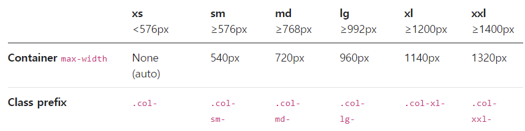

### 목차

- [CSS layout](#css-layout)
  * [Float](#float)
  * [Flexbox](#flexbox)
  * [Bootstrap](#bootstrap)
    + [spacing](#spacing)
    + [Responsive Web Design](#responsive-web-design)
    + [Grid System](#grid-system)

<br>

## CSS layout

css가 원래는 html에서 사진을 어떻게 배치할 것인가에 관한 거였고 float 많이 사용했는데 글, 그림 뿐만 아니라 이것저것 많이 넣기 시작하면서 layout이 중요해졌고 layout 용도로 **flex, grid** 많이 사용


### Float

- 원래는 이미지 좌,우 주변으로 텍스트 둘러싸는 레이아웃을 위해 도입 -> 다른 요소들에도 적용해 웹 사이트 전체 레이아웃 만드는 데까지 사용했음
- Float 속성
  - `none` : 기본값
  - `left` : 요소를 왼쪽으로 띄움
  - `right` : 요소를 오른쪽으로 띄움
- 주위의 인라인, 텍스트 요소를 띄워 자신을 감싸게 함

- 개별 요소에 적용

- 다른 요소가 감싸거나 겹쳐지지 못하게 하려면

```css
.clearfix::after {
      content: "";
      display: block;
      clear: both; 
    }
```

-> float 사용 안 하고 flex해서 justify-content 하면 간단

**float이 어떤 식으로 동작하는지 알면 되고, 중요한 건 flex**

---


### Flexbox

- 2가지만 기억하자: 요소, 축
  - 축
    - 메인축: 왼->오
    - 교차축: 위->아래
  - 요소
    - flex container: 부모. 여기에 `display: flex` 작성 -> 부모요소 컨트롤하는 것으로 요소 레이아웃 지정(inline-flex는 많이는 안 씀)
    - flex item: 실제 정렬되는 대상


- display: flex 밑에 작성

  - 배치 방향 설정
    - `flex-direction`: 메인축의 방향(item이 쌓이는 방향)을 변경

      => `row`(좌->우), `row-reverse`(우->좌), `column`,(위->아래) `column-reverse`(아래->위)

    

  - 메인축/교차축 방향 정렬
    - `justify`: direction 기준 **메인축** 위에서 움직이겠다(x축 정렬 아님!)
    - `align`: **교차축** 위에서 움직이겠다.

    

    - `content`: 부모요소에 작성. 여러 개(여러 줄 취급)를 한꺼번에 움직임
    - `items`: 부모요소에 작성. 한 줄(여러 개가 묶여서 한 줄로 취급)
    - `self`: 자식요소에 작성. 개별 요소 컨트롤


- justify-content & align-content
  - `flex-start`: 시작지점부터 차례로(기본 값)
  - `flex-end`: 순서 역순X, 그냥 뒤로 밀어서 배치
  - `center`: 정중앙
  - `space-between`: 좌우정렬(item들 간 간격 동일)
  - `space-around`: 균등 좌우 정렬(내부 요소 여백=외곽 여백 * 2) (요소들이 모두 같은 양쪽 여백 가짐)
  - `space-evenly` : 균등 정렬(내부 요소 여백=외곽 여백)
- align-items & align-self
  - `flex-start`
  - `flex-end`
  - `center`
  - `baseline` : item 내부의 text 기준선에 맞춤
  - `stretch`: 컨테이너 가득 채움(align-items 기본값)
  - `auto`: align-self에서만 가능! (align-self 기본값)

- `justify content: center;` `align-items:center;` 하면 상하좌우 정중앙에 배치


- `flex-wrap: wrap` : 강제 한 줄 배치 X. 다음 줄로 넘김

- `flex-wrap: nowrap`: 강제 한 줄 배치(기본값). 넷플릭스 영화 넘기는 부분처럼! 화면에 보이는 부분 따로, 관리하는 부분 따로. hidden 설정을 하면 나머지는 안 보이게. 화면에 보이는 부분은 고정이고 관리하는 부분을 움직이게 해서 버튼으로 넘기는 것! => `carousel`

  => vanilla js carousel / slider 검색하면 많이 나옴! 

- `flex-wrap: wrap-reverse`: 넘치면 윗줄로(역순)


- `flex-flow`

  : flex-direction과 flex-wrap의 shorthand

  ex) `flex-flow: row wrap;`

- `order`: 기본값 0, 작은 숫자일수록 우선 쌓이는 방향으로 이동

- `flex-grow`: 남는 공간을 항목들에 분배하는 방법(기본값 0, 음수 불가)

  -> 근데 flex-grow 직접 주는 것보다 **grid로 비율 조작**하는 게 더 자연스러움

---


### Bootstrap

- responsive, mobile-first sites(화면 크기, 해상도 제각각인 다양한 디바이스)

- 소스는 하난데 웹이든 모바일이든 크기가 어떻든 잘 적용돼서 보일 수 있게 도와줌: **반응형 웹 디자인**

  (원래 있던 게 내용이 너무 많고 유지보수가 힘들면 모바일용으로 반응형 화면을 새로 만들기도 함 ex. 네이버)

- cross browsing: 모두가 동일해야 한다는 게 X, 표준에 맞게 모두 동등하게 보일 수 있게 하는 것

- 매번 bootstrap의 .css, .js 파일 다운 받아 사용하긴 번거로움 -> CDN에서 가져옴

- **CDN**: 컨텐츠가 분산되어 관리되고 있고, 가장 가까운 외부 서버에서 가져옴. 어느 곳에서 접근해도 동일한 품질을 제공받을 수 있게 함

  (프론트엔드 개발 시 별도의 서버에 파일 저장해놓고 커스텀 할 수 있음)


#### spacing

- `m`: margin
- `p`: padding


- `t`: top
- `b`: bottom
- `s`: **left**
- `e`: **right**
- `x`: 좌우
- `y`: 상하


- `0`: 0rem

- `1`: 0.25rem
- `2`: 0.5rem
- `3`: 1rem = 16px
- `4`: 1.5rem
- `5`: 3rem


- `mx-0`: 마진, x축, 왼오 0으로
- `mx-auto`: 수평(좌우) 중앙정렬
- `ms-auto`: margin-left에 auto -> 오른쪽 정렬

(마진 더 주고 싶으면 내가 만들어서 하면 됨)


- `text-decoration-none`: 링크에 밑줄 X
- `d-inline`: display: inline
- `d-block`: display: block
- `box` : 박스


- `d-md-none d-xl-block`: display: none, breakpoint midium => 중간사이즈까진 안 보이고 그 이후엔 block
- `d-flex justify-content-center` 이런 식으로 작성

---

#### Responsive Web Design

- 다양한 화면 크기를 가진 디바이스에 responsive한 웹 디자인


---

#### Grid System

- Grid system: 12칸 나눠먹기

  - **12개의 컬럼, 6개의 breakpoint**
- `container`, `row`, `column`으로 컨텐츠 배치&정렬
  - `display: grid`로도 할 수 있지만 지금은 grid system으로


- breakpoints
  
  - bootstrap에 @media 쿼리로 표현되어 있음 (디바이스 크기에 맞춰 내가 조절 가능하나 bootstrap도 잘 만들어져 있으니 지금은 가져다 사용)
  
  


- 그리드 시스템 연습
  - `box col-2 col-sm-8 col-md-4 com-lg-5`: sm이하는 2, sm~md 사이는 8, md는 4, lg 이후는 5
  - grid에선 꽉차면 무조건 내려가니까 nowrap이 상관 없음(한줄로 하고싶으면 flex로..?)
  - `offset-4`: 해당 요소의 앞에 4칸 여유를 두겠다!