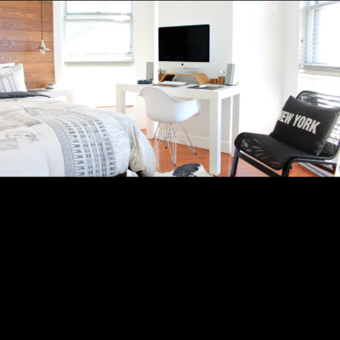
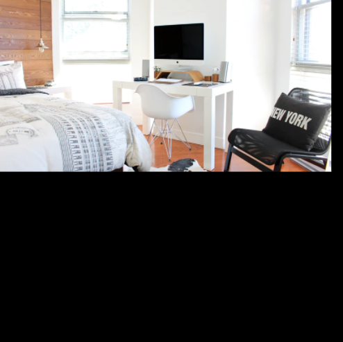

[toc]

# Background

## background-color

- 값
  - hex
  - rgb
  - rgba

## background-image

- 반드시 사용해야 하는 함수 `url()`
  - css애서 사용할 이미지의 경로를 이 안에 넣음
  - 절대 경로, 상대 경로 모두 ok

## background-repeat

- 기본적으로 background image를 넣으면 repeat 됨

- 값
  - repeat(기본값)
  - no-repeat

## background-size

- 값

  - contain

    - 빈 공간이 있더라도 요소 안에 이미지가 다 들어갈 수 있게

      

  - cover

    - 요소가 잘리더라도 사이즈에 맞춰서

      

  - custom

    - ex) `background-size: auto 50%;`

      

## background-position

- x축 위치, y축 위치를 명시
- 예시
  - `background-position: left bottom;`
  - `background-position: center center;`
  - `background-position: 10px 30px;`