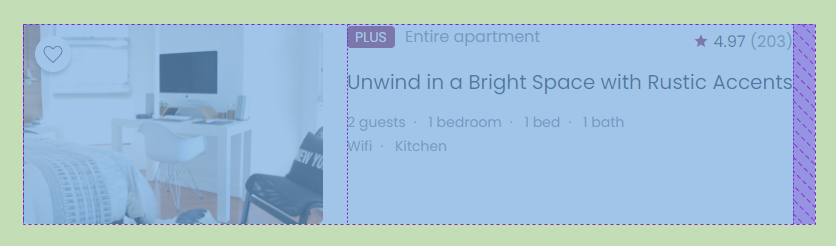

# CSS

- `sr-only` 철벽 방어

  ```css
  .sr-only {
    position: absolute;
    z-index: -100;
    /* width나 height 0px로 주면 display: none과 같게 처리함 */
    width: 1px;
    height: 1px;
    overflow: hidden;
    opacity: 0;
  }
  ```

  - `display: none`을 하지 않는 이유
    - 우리 눈에서만 안 보이고 스크린 리더는 읽어줬으면 좋겠는데, display를 none으로 주면 스크린 리더도 해당 요소를 읽어주지 않기 때문


- img가 아니라 background를 사용하는 경우
  - 이미지가 가로가 길 수도 있고 세로가 길 수도 있는 경우, `img` 태그로 처리하면 각 유형에 맞게 처리해주어야 함
  - 하지만 `background`를 사용하면 이미지의 원래 크기와 상관 없이 좀 더 쉽게 처리 가능


- css로 가운뎃 점 찍기

  ```css
  .property-detail dd span::after {
    content: '·';
    margin: 0 8px;
  }
  
  /* 마지막 요소에 뒤에 붙는 거 없애기 */
  .property-detail dd span:last-child::after {
    content: '';
    margin: 0;
  }
  ```

  - 의미를 갖지 않는 가운뎃 점은 이렇게 css로 처리하는 것도 좋은 방법인 듯하다


- `flex-grow`

  

  - 우측 content 공간에 width를 주지 않으면 위 사진의 보라색 공간처럼 의도치 않은 여백이 생김
  - 현재 전체 카드는 `display: flex`가 적용된 상태이므로 우측 content 공간에 `flex-grow: 1`을 주면 flex-container에서 가능한 공간을 차지할 수 있음(=보라색 여백 없애줄 수 있음)
  - 참고: [flex-grow](https://developer.mozilla.org/ko/docs/Web/CSS/flex-grow)