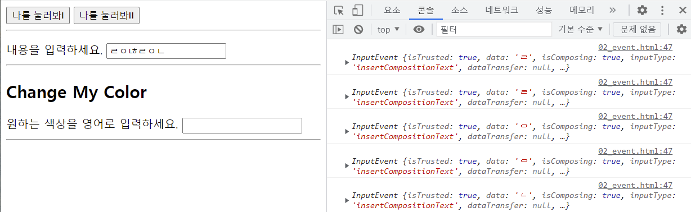

### 목차

- [JavaScript 01](#javascript-01)
  * [JavaScript Intro](#javascript-intro)
    + [브라우저](#브라우저)
    + [JavaScript의 필요성](#javascript의-필요성)
  * [DOM](#dom)
    + [브라우저에서 할 수 있는 일](#브라우저에서-할-수-있는-일)
    + [DOM(Document Object Model)](#domdocument-object-model)
    + [BOM(Browser Object Model)](#bombrowser-object-model)
  * [DOM 조작](#dom-조작)
    + [:star: DOM 조작 순서 :star:](#star-dom-조작-순서-star)
    + [DOM 관련 객체의 상속 구조](#dom-관련-객체의-상속-구조)
    + [메서드](#-1)
      - [선택 관련 메서드](#선택-관련-메서드)
      - [변경 관련 메서드](#변경-관련-메서드)
      - [삭제 관련 메서드](#삭제-관련-메서드)
      - [속성 관련 메서드](#속성-관련-메서드)
    + [속성](#-2)
    + [DOM 조작](#dom-조작)
  * [Event](#event)
    + [Event의 역할](#event의-역할)
    + [Event handler: addEventListner](#event-handler-addeventlistner)
    + [Event 취소](#event-취소)

 

# JavaScript 01

## JavaScript Intro

### 브라우저

- 웹 서버에서 이동하며 클라이언트와 서버 간에 양방향으로 통신하고, HTML 문서나 파일을 출력하는 GUI 기반의 소프트웨어

  => 클라이언트의 요청을 서버에 전달하고, 서버로부터 응답(HTML/CSS/JS가 들어있는 문서 등등)을 받아 보여주는 소프트웨어

  => 브라우저가 JS 코드를 동작시킴

### JavaScript의 필요성

- 브라우저 화면을 '동적'으로 만들기 위함 -> 서버와 상관없이 화면이 움직이는! 화면 조작

  전에 배웠던 건 DB 사용에 따라 동적으로 구성할 수 있냐 없냐였음(dynamic)

- 브라우저를 조작할 수 있는 유일한 언어

 

## DOM

### 브라우저에서 할 수 있는 일

1. 문서 조작(DOM)
2. 브라우저 조작(BOM)
3. 프로그래밍 언어로서 사용 - Data Structure, Conditional Expression, Iteration

### DOM(Document Object Model)

- HTML 파일을 프로그래밍 object로서 표현한 것

  => 문서를 구조화하고, 구조화 된 각 구성 요소들을 객체(object)로 취급

### BOM(Browser Object Model)

- 브라우저를 object로서 표현한 것

- window 객체: 브라우저의 창(window)을 지칭

  => window가 document보다 더 큰 개념

 

## DOM 조작

### :star: DOM 조작 순서 :star:

1. 선택
2. 변경

### DOM 관련 객체의 상속 구조

> EventTarget -> Node -> Element / Document -> HTML Element

- EventTarget
  - Event Listener를 가질 수 있는 객체가 구현하는 DOM 인터페이스
- Node
  - 여러가지DOM 타입들이 상속하는 인터페이스
- Element
  - Document 안의 모든 객체가 상속하는 클래스
- Document
  - 브라우저가 불러온 웹 페이지를 나타냄
  - DOM 트리의 진입점 역할 수행
- HTML Element
  - 모든 종류의 HTML 요소

### 메서드

#### 선택 관련 메서드

- `document.querySelector(selector)`
  - 해당 selector와 일치하는 첫 번째 element 객체 반환(없으면 null)
- `document.querySelectorAll(selector)`
  - 해당 selector와 일치하는 여러 element 선택 -> NodeList 반환

- `getElementById(id)`, `getElementByTagName(name)`, `getElementByClassName(names)`도 있지만 QuerySelector(All) 사용 시 id, class, tag 등을 모두 사용 가능하므로 이것을 사용!

#### 변경 관련 메서드

- `document.createElement()`
  - 작성한 태그 명의 HTML 요소 생성&반환
- `Element.append()`
  - 특정 부모 Node의 마지막 자식 다음에 Node 객체/DOMString(문자열) 삽입
  - 여러 개의 Node 객체, DOMString 추가 가능
  - 반환값 X
- `Element.appendChild()`
  - 특정 부모 Node의 마지막 자식으로 **Node 객체** 삽입
  - 한 번에 하나만 추가 가능
  - 추가된 Node 객체 반환

#### 삭제 관련 메서드

- `ChildNode.remove()`

  - Node가 속한 트리에서 해당 Node 제거

- `Node.removeChild()`

  - DOM에서 해당 자식 Node를 제거하고 제거된 Node 반환

#### 속성 관련 메서드

- `Element.setAttribute(name, value)`

  - 속성이 이미 존재하면 값 갱신, 존재하지 않으면 새로 추가

    ex) `btn.setAttribute('class', 'btn-danger')`

- `Element.getAttribute(attributeName)`

  - 해당 요소의 지정된 값(문자열) 반환

    ex) `form.getAttribute('id')`

### 속성

- `Node.innerText`

  - Node 객체와 그 자손의 DOMString 표현(해당 요소 내부의 raw text)

- `Element.innerHTML`

  - 요소 내에 포함된 HTML 마크업 반환

    ex) `liTag2.innerHTML = '<li>대전</li>'` => 작성하면 li 태그 떼고 추가됨

  - *XSS 공격에 취약하므로 사용 시 주의*

### DOM 조작

- HTMLCollection, NodeList 모두 Live Collection => DOM 변경사항 실시간 반영

  :star: But `querySelectorAll()`에 의해 반환되는 NodeList는 Static Collection! (실시간 반영 X)

 

## Event

### Event의 역할

> "~ 하면 ~ 한다."
>
> > "클릭하면, 경고창을 띄운다."
> >
> > > "특정 이벤트가 발생하면, 할 일을 등록한다."

### Event handler: addEventListner

- `EventTarget.addEventListener(type, listener[, options])`

  - type

    : 반응할 이벤트 유형 ex) `'click'`, `'submit'` 등

  - listener

    - EventListener 인터페이스 or 콜백 함수여야 함

- input 값을 가져다가 사용하고자 할 때

  - querySelector 해서 가져다가 하나씩 쌓지 말고

	
	
	- event 객체 이용
	
	  => `myPtag.innerText = event.target.value`

### Event 취소

- `Event.preventDefault()`

  - 현재 이벤트의 기본 동작을 막음

    ex) form 태그: form 데이터 전송을 막음

