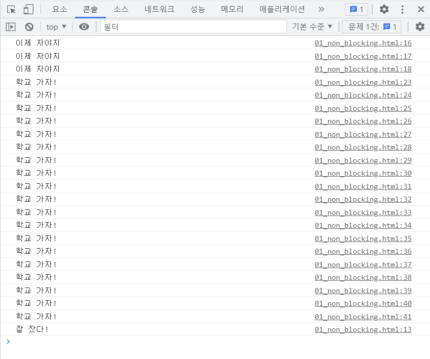

### 목차

- [JavaScript 02](#javascript-02)
  * [AJAX](#ajax)
    + [AJAX](#ajax-1)
    + [XMLHttpRequest 객체](#xmlhttprequest-객체)
  * [Asynchronous JavaScript](#asynchronous-javascript)
    + [Concurrency model](#concurrency-model)
    + [Zero delays](#zero-delays)
    + [순차적인 비동기 처리](#순차적인-비동기-처리)
  * [Callback Function](#callback-function)
    + [Callback function](#callback-function-1)
    + [JavaScript의 함수는 "일급 객체"](#javascript의-함수는-일급-객체)
    + [Async callbacks (비동기 콜백)](#async-callbacks-비동기-콜백)
    + [Callback Hell](#callback-hell)
  * [Promise](#promise)
    + [Promise object](#promise-object)
    + [Async callback 작성 스타일과 달리 Promise가 보장하는 특징](#async-callback-작성-스타일과-달리-promise가-보장하는-특징)
  * [Axios](#axios)
  * [async & await => 더 알아보기](#async--await--더-알아보기)

<br>

# JavaScript 02

## AJAX

### AJAX

- Asynchronous JavaScript And XML (비동기식 JS와 XML)

- 서버와 통신하기 위해 **XMLHttpRequest** 객체 활용

- JSON, XML, HTML, 일반 텍스트 형식 등을 포함한 다양한 포맷을 주고 받을 수 있음

- 페이지 전체를 reload 하지 않고서도 수행되는 **비동기성**

  => 페이지 새로고침 없이 서버에 요청 가능

  => 서버로부터 데이터 받고 작업 수행


### XMLHttpRequest 객체

- 서버와의 상호작용을 위해 사용됨
- 전체 페이지의 새로고침 없이 데이터 받아올 수 있음

<br>

## Asynchronous JavaScript

- 동기식

  - 순차적, 직렬적 Task 수행
  - 요청을 보낸 후 응답을 받아야만 다음 동작 수행 (blocking)

- 비동기식

  - 병렬적 Task 수행
  - 요청을 보낸 후 응답을 기다리지 않고 다음 동작 수행 (non-blocking)

  => `alert()`에 대해 확인 버튼 눌러야만 다음 동작 수행하는 것도, 데이터 요청 보내고 응답 안 받았어도 `console.log()` 문장 실행 가능한 것도 "JavaScript가 single threaded"이기 때문!

  => Call Stack이 하나인 언어라는 의미


### Concurrency model

- Event loop를 기반으로 하는 동시성 모델
  1. Call Stack
     - 요청이 들어올 때마다 해당 요청을 순차적으로 처리하는 Stack 형태의 자료 구조
  2. Web API
     - JavaScript 엔진이 아닌 브라우저 영역에서 제공하는 API
     - `setTimeout()`, DOM events, AJAX로 데이터를 가져오는 등 시간이 소요되는 일들을 처리
  3. Task Queue
     - Web API에서 처리가 끝난 Task들이 Call Stack으로 가기 전에 대기하는, Queue 형태의 자료 구조
  4. Event Loop
     - Call Stack이 비어 있는지 확인
     - 비어 있는 경우 Task Queue에 실행 대기 중인 콜백 함수 있는지 확인 -> 있다면 가장 앞에 있는 콜백 함수를 Call Stack으로 push

- 콜백함수
  - Web API로 갔다가, Task Queue로 갔다가, Call Stack으로 다시 BACK


### Zero delays

- `setTimeout()` 함수에서 시간이 0으로 되어 있어도, 0초 후에 콜백 함수가 시작된다는 뜻이 아님

  => 일단 Web API로 보내지고, Web API에서 0초 대기 후 Task Queue로 갔다가, Call Stack 비어있으면 Call Stack으로 가서 실행되므로 0초는 *요청 처리에 필요한 최소 시간*을 의미

  :star: 만약에 console.log() 함수가 아주 많고, 한 2~3번째 줄에 setTimeout() 함수 있다면? console.log() 함수들 중간에 setTimeout() 함수가 Call Stack으로 돌아올 수 있을까?
  
  
  
  => `console.log('학교 가자!')`가 계속해서 Call Stack으로 들어오기 때문에 `console.log('잘 잤다!')` 는 계속 Task Queue에서 대기하다가 학교 가자 요청이 모두 처리되어서 Call Stack이 비었을 때 Call Stack으로 들어와 실행되는 것..?


### 순차적인 비동기 처리

- Web API로 들어오는 순서는 중요 X, 어떤 이벤트가 먼저 처리되는지가 중요 (실행순서 불명확)
- 이를 해결하기 위한 처리 방식
  1. Async callbacks
  
     - 백그라운드에서 실행을 시작할 함수를 호출할 때 인자로 지정된 함수
  
       ex) `addEventListener()`의 두 번째 인자
  
       => 어떤 이벤트가 발생하면 - 해당 콜백 함수 실행 => 순차적 처리!
  
  2. promise-style
  
     - XMLHttpRequest 객체를 사용하는 것보다 좀 더 현대적인 버전

<br>

## Callback Function

### Callback function

- 다른 함수에 인자로 전달된 함수

- 동기식, 비동기식 모두 사용 가능하나 비동기식에서 더 많이 사용됨

  - 명시적 호출이 아니라 특정 루틴/action에 의해 호출됨(조건에 의해)

    => 비동기 로직 수행 시 필수!


### JavaScript의 함수는 "일급 객체"

- 일급 객체 (일급 함수)
  - 다른 객체들에 적용할 수 있는 연산을 모두 지원하는 객체(함수)
    1. 인자로 넘길 수 있어야 하고
    2. 함수의 반환 값으로 사용할 수 있어야 하고
    3. 변수에 할당할 수 있어야 함


### Async callbacks (비동기 콜백)

- 다른 함수의 인수로 전달할 때 즉시 실행되지 않고, 함수의 body에서 "call back" 됨


### Callback Hell

- 순차적인 연쇄 비동기 작업 처리하고자 할 때 callback 함수를 호출하고 그 다음 호출 그 다음 호출... 의 패턴 반복

  => 콜백 지옥

- 해결 방법

  1. 코드의 깊이를 얕게 유지
  2. 모듈화
  3. 모든 단일 오류 처리
  4. **Promise callback 방식 사용**

<br>

## Promise

### Promise object

- 비동기 작업의 최종 완료/실패를 나타내는 객체

- 성공에 대한 약속 => `.then(response)`

- 실패에 대한 약속 => `.catch(error)`

  => 두 메서드 모두 promise 객체 반환 => chaining (**반환값이 있어야 받아서 chaining 가능**)

- `.finally(callback)`

  : 성공하든 실패하든 실행되므로 인자를 받지 않음


### Async callback 작성 스타일과 달리 Promise가 보장하는 특징

- callback 함수는 JS의 Event Loop가 현재 실행 중인 Call Stack을 완료하기 이전에는 절대 호출되지 않음
- `.then()`을 여러 번 사용하여 여러 개의 callback 함수 추가 가능(:star: Chaining)

<br>

## Axios

- Axios

  - 브라우저를 위한 Promise 기반의 클라이언트

  - 응답을 promise로 줌 -> `.then` 사용 가능

    ```html
    axios.get(URL)
    	.then(response => {
    		return response.data
    	})
    	.then(response => {
    		return response.title
    		// response.data.title
    	})
    	.catch(error => {
    		// ....
    	})
    ```

<br>

## async & await => 더 알아보기

- 비동기 코드를 작성하는 새로운 방법

- 리턴한 것을 promise 형태로 감싸서 사용했어서 then, catch 가능했던 건데, async&await 활용하면 response로 받아서 사용 가능!

  => Promise 구조의 then chaining 제거