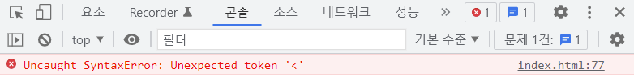
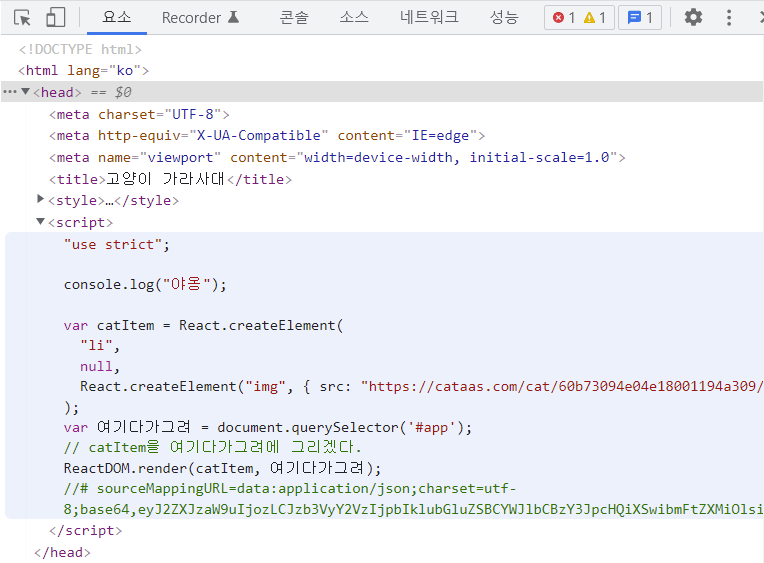

[toc]

# 만들면서 배우는 리액트: 기초

## 리액트가 왜 좋은가요?

### 웹사이트 움직이게 만들기

- 내 행동에 따라 화면이 하나하나 바뀌게 만들려면, 자바스크립트를 이용할 경우 한땀한땀 처리해야 하는데 쉽지 않음
- 요즘에는 특히 js로 만들기 어려움. 그래서 나온 게 리액트
- React
  - 자바스크립트 라이브러리의 일종

### 리액트 맛보기

- 일반 html 파일에서 JSX를 사용하면 아래와 같은 에러가 뜸

	

1. React, ReactDOM 코드 추가

   ```html
   <script src="https://unpkg.com/react@17/umd/react.production.min.js" crossorigin></script>
   <script src="https://unpkg.com/react-dom@17/umd/react-dom.production.min.js" crossorigin></script>
   ```

2. babel 코드 추가

   ```html
   <script src="https://unpkg.com/babel-standalone@6/babel.min.js"></script>
   ```

3. `<script>` 태그에 type 추가

   ```html
   <script type="text/babel">
   	...
   </script>
   ```

(참고: https://ko.reactjs.org/docs/add-react-to-a-website.html) 

### Babel

- The compiler for next generation Javascript
  - 새로운 js 문법을 위해 브라우저가 이해할 수 있는 js로 바꿔주는 통역사

- 브라우저는 `<head>` 내의 `<script>`를 읽어서 react를 그릴 수 있게 된 것!

  

### JSX로 HTML과 JavaScript 짬뽕하기

- 리액트에서 js 문법 사용하기

    ```react
    const catItem = (
          <li>
            
          </li>
    );
    const FOO = "hello world";
    const favorites = (
          // js 문법(표현식!)을 react에서도 쓰려면 중괄호를 이용하면 됨
          // 표현식: 어떤 값을 반환하는 식
          <ul class="favorites">
            {1 + 2}
            {FOO}
            {FOO === "hello world" ? "true" : "false"}
            {catItem}{catItem}{catItem}
          </ul>
    );
    const 여기다가그려 = document.querySelector('#app');
    ReactDOM.render(favorites, 여기다가그려);
    ```

- 리액트에 그리려면 최상위 태그가 하나여야 함 -> 태그로 묶어주기

	

<br>

## 리액트 앱 바닥부터 만들기

### 컴포넌트가 뭔가요?

- 리액트에서 컴포넌트는 함수를 이용해서 만들 수 있음

### 스타일링

- 리액트에서 html 프로퍼티가 다른 경우가 왕왕 있음

  - `class` => `className`

  - `onclick="sayHi()"` => `onClick={sayHi}`

  - 오브젝트를 이용하여 style 프롭 넘기기

    ```react
    function CatItem(props) {
        return (
            <li>
                
            </li>
        );
    }
    ```

- emotion library
  - style이 아닌 css 프롭을 string으로 넘김 - 자잘한 스타일링은 이렇게 하신다고 함
  - styled component 방식도 존재 (컴포넌트가 CSS를 들고 있을 수 있게?) - 기본적으로는 이렇게 하신다고 함
- tailwind css library
  - 클래스 이름을 미리 정의해둔 라이브러리

### 이벤트 다루기

- 예시

  ```react
  const MainCard = (props) => {
      // 리액트에서 이벤트 핸들러 이름 짓는 관례
      // ex) handle어쩌구Click() , handle어쩌구MouseOver()
      function handleHeartClick() {
          console.log("하트 눌렀음");
      }
      return (
          <div className="main-card">
              
              <button onClick={handleHeartClick}>🤍</button>
          </div>
      );
  }
  ```


### useState

- useState() 호출 시 배열이 반환되고, 이 배열은 2개의 원소를 가짐

  ```react
  const [state, setState] = useState(initialState);
  // state: 현재 상태
  // setState: 상태값 설정 함수
  // 이름은 자유롭게 설정 가능
  ```

- 상태를 설정하려면 엘리먼트가 아닌 컴포넌트여야 함

  ```react
  // ex.
      const App = () => {
        // 컴포넌트여야 이렇게 상태를 설정할 공간이 있음
        const [counter, setCounter] = React.useState(1);
        const [imgSrc, setImgSrc] = React.useState("https://cataas.com/cat/60b73094e04e18001194a309/says/react");
  
        function handleFormSubmit(event) {
          event.preventDefault();
          setCounter(counter + 1);
          setImgSrc("https://cataas.com//cat/5e9970351b7a400011744233/says/inflearn");
        }
        return(
          <div>
            <Title>{counter}번째 고양이 가라사대</Title>
            <CatForm handleFormSubmit={handleFormSubmit} />
            <MainCard img={imgSrc} />
            <Favorites />
          </div>
        );
      };
  ```

  

- 헷갈리는 개념: 엘리먼트 vs 컴포넌트

  ```react
  // 엘리먼트
  const element = <h1>Hello, world</h1>;
  ```

  - 화면에 보이는 것을 구성함
  - camelCase 사용

  ```react
  // 컴포넌트
  function Welcome(props) {
    // props: 컴포넌트의 입력값
    return <h1>Hello, {props.name}</h1>;
  }
  
  // 컴포넌트는 ES6 class로도 작성 가능
  class Welcome extends React.Component {
    render() {
      return <h1>Hello, {this.props.name}</h1>;
    }
  }
  ```

  - 리액트 엘리먼트를 반환하는 함수
  - PascalCase 사용

### 리스트

- JavaScript`map()`을 통해 리스트의 각 요소를 엘리먼트로 처리할 수 있음

  ```react
  function Favorites() {
      const CAT1 = "https://cataas.com/cat/60b73094e04e18001194a309/says/react";
      const CAT2 = "https://cataas.com//cat/5e9970351b7a400011744233/says/inflearn";
      const CAT3 = "https://cataas.com/cat/595f280b557291a9750ebf65/says/JavaScript";
  
      const cats = [CAT1, CAT2];
  
      return (
          <ul className="favorites">
              {cats.map((cat) => (
                  <CatItem img={cat} key={cat} />
              ))}
          </ul>
      );
  }
  ```

- 리스트 사용 시 `key` 명시하지 않으면 아래와 같은 에러 발생

  `Warning: Each child in a list should have a unique "key" prop.`

### 폼 다루기

- 인풋 값이 변경될 때마다 함수를 부르라는 뜻의 내장 api: `onChange`

  ```react
  <input
      type="text"
      name="name"
      value={value}
      placeholder="영어 대사를 입력해주세요"
      onChange={handleInputChange}
      />
  ```

### 로컬스토리지에 데이터 싱크하기

- 로컬스토리지에는 데이터가 String으로 저장되므로 숫자가 필요하면 Number로 변환 혹은 파싱

  ```react
  const [counter, setCounter] = React.useState(Number(localStorage.getItem("counter")));
  // OR
  getItem: (key) => {
      return JSON.parse(localStorage.getItem(key));
  },
  ```

  
