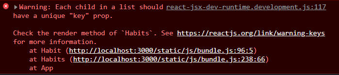

[toc]

## JSX에서 자식 다루기

참고: [React 공식문서](https://ko.reactjs.org/docs/jsx-in-depth.html#children-in-jsx)

### 문자열 리터럴

- 여는 태그와 닫는 태그 사이에 문자열을 넣을 수 있고, `props.children`이 해당 문자열이 됨

  ```react
  <Title>Hello World!</Title>
  // 여기서 "Hello World!"는 Title의 props.children
  ```

### JSX를 자식으로 사용하기

- JSX element를 자식으로 넘겨 줄 수 있음

  ```react
  <MyContainer>
    <MyFirstComponent />
    <MySecondComponent />
  </MyContainer>
  ```

### boolean, null, undefined는 무시됩니다.

- 조건부 렌더링 시 유용하게 사용 가능

  ```react
  const name = undefined;
  <div>
    {name && <h1>Hello {name}</h1>}
  </div>
  ```

- `0`과 같은 falsy 값들은 렌더링 됨

  ```react
  <div>
    {props.messages.length &&
      <MessageList messages={props.message} />
    }
  </div>
  ```

- `false`, `true`, `null` 등의 값을 출력하고 싶다면 문자열로 변환

  ```react
  <div>
    My JS variable is {String(myVariable)}
  </div>
  ```

<br />

## Key prop

- map 함수를 사용해서 JSX 리스트를 구현할 경우 key prop을 통해 각 요소를 구별해주어야 불필요한 리렌더링을 막을 수 있다.

  

- 이때 key prop은 자식 컴포넌트에 작성한다.

  ```react
  // Yes
  function Habits() {
    const [habits, setHabits] = React.useState([
      {id: 1, name: 'Reading', count: 0},
      {id: 2, name: 'Running', count: 0},
      {id: 3, name: 'Coding', count: 0},
    ]);
    return (
      <ul>
        {habits.map(habit => (
          <Habit key={habit.id} habit={habit} />
        ))}
      </ul>
    );
  }
  
  // No
  function Habit({ habit }) {
    const { name, count } = habit;
    return (
      <li key={habit.id} className="habit">
        <span className="habit-name">{name}</span>
        <span className="habit-count">{count}</span>
      </li>
    );
  
  }
  ```

  
