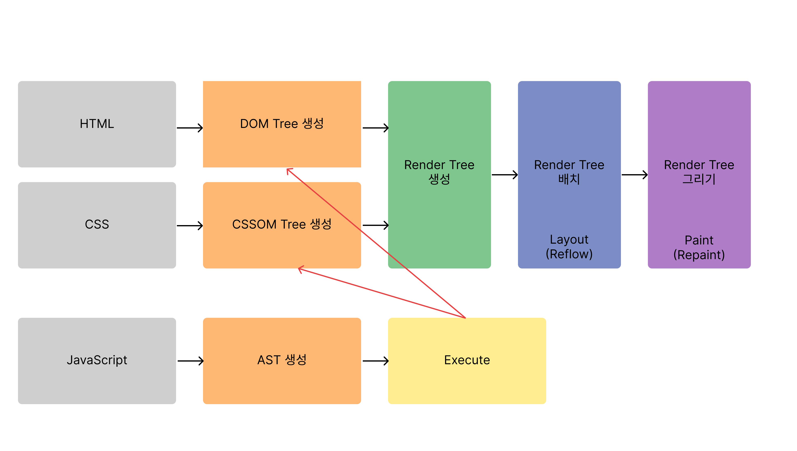

# 브라우저 렌더링 과정

## 브라우저의 기본 구조

1. 사용자 인터페이스 - 주소 표시줄, 이전/다음 버튼, 북마크 메뉴 등 웹 페이지를 제외한 나머지 모든 부분. 사용자와 상호작용하는 사용자 인터페이스
2. 브라우저 엔진 - 사용자 인터페이스와 렌더링 엔진 사이의 동작을 제어
3. 렌더링 엔진 - 요청한 웹 페이지를 표시 ex) HTML을 요청하면 HTML과 CSS를 파싱하여 화면에 표시함
4. 통신(Networking) - HTTP 요청과 같은 네트워크 요청을 수행. 이것은 플랫폼 독립적인 인터페이스이고 각 플랫폼 하부에서 실행됨
5. UI 백엔드 - 체크박스, 버튼, 창 같은 기본적인 위젯을 그림. OS 사용자 인터페이스 체계 사용
6. 자바스크립트 해석기(Interpreter) - 자바스크립트 코드를 해석하고 실행.
7. 자료 저장소 - localStorage, Cookie처럼 자료를 저장하는 계층. HTML5 명세에는 브라우저가 지원하는 '[웹 데이터 베이스](http://www.html5rocks.com/en/features/storage)'가 정의되어 있다.

→ 여기에서 렌더링 엔진을 중심으로 브라우저 렌더링 과정을 설명할 것이다.

## 렌더링 엔진

- 렌더링 엔진은 요청받은 내용을 브라우저 화면에 표시하는 역할을 한다.
- 웹 브라우저마다 렌더링 엔진이 웹 표준을 준수하면서도 조금씩 다르게 동작하는 부분이 있다. Chrome은 Blink, Safari는 Webkit (Blink는 Webkit에서 파생되었다.), Firefox는 Gecko라는 엔진을 사용한다.

## 렌더링 엔진의 동작 과정

### HTML 파싱 & DOM 생성

1. 브라우저의 요청에 의해 서버가 응답한 HTML 문서는 문자열로 이루어진 텍스트이다. 이를 브라우저에 시각적인 픽셀로 렌더링하기 위해 HTML 문서를 브라우저가 이해할 수 있는 자료구조로 변환해서 메모리에 저장한다.
2. 메모리에 저장된 바이트(2진수) 형태로 문서를 전달받은 브라우저는 이를 `meta` 태그의 `charset` 어트리뷰트에 선언된 인코딩 방식으로 문자열로 변환한다.
3. 문자열로 변환된 HTML 문서를 토큰화 한다.
4. 각 토큰을 객체로 변환해서 노드를 생성한다. 토큰의 내용에 따라 문서 노드, 요소 노드, 어트리뷰트 노드, 텍스트 노드, 코멘트 노드가 생성된다.
5. HTML 요소 간의 중첩 관계를 반영하여 각 노드가 연관성을 가질 수 있도록 모든 노드들을 트리 자료구조(→DOM)로 구성한다.

- +) HTML 문서를 파싱하는 과정에서  `style`, `link` 등의 태그를 만나면 DOM 생성을 일시 중단하고 CSS, JavaScript처럼 필요한 파일들을 불러온다.

  - 이처럼 브라우저는 동기적으로 HTML, CSS, JavaScript를 파싱하고 실행한다. 따라서 `scipt` 태그의 위치에 따라 HTML 파싱이 블로킹 될 수 있으므로 `script` 태그의 위치는 중요하다.

### CSS 파싱 & CSSOM 생성

- CSSOM: DOM이 어떻게 화면에 표시될 지 알려주는 역할
- CSS는 HTML과 동일한 파싱 과정(바이트→문자→토큰→노드→CSSOM)을 거쳐 CSSOM을 생성한다. CSSOM은 CSS의 상속을 반영하여 생성된다. CSS 파싱을 완료하면 HTML 파싱이 중단된 지점부터 다시 HTML을 파싱한다.

### 렌더 트리 생성

- 렌더 트리: 렌더링을 위한 트리 형태의 자료구조. 화면에 렌더링되는 노드만 포함한다. (ex. `meta` , `script` 태그, `display: none;` 속성을 가진 요소 등은 비포함)
- 렌더링 엔진은 생성된 DOM, CSSOM을 렌더 트리로 결합한다.

### JavaScript 파싱 & 실행

- HTML 문서를 파싱한 결과물로 생성된 DOM은 HTML문서의 구조와 정보, HTML 요소와 스타일 등을 변경할 수 있는 프로그래밍 인터페이스로서 DOM API를 제공한다. 즉, JavaScript 코드에서 DOM API를 사용하면 DOM을 동적으로 조작할 수 있다.
- 자바스크립트 파싱은 렌더링 엔진이 아닌 자바스크립트 엔진이 처리한다.

1. 자바스크립트 코드 토큰화
2. 이를 파싱하여 AST(Abstract Syntax Tree, 추상적 구문 트리 : 토큰에 문법적 의미, 구조를 반영한 트리 형태의 자료구조) 생성
3. AST를 바이트 코드로 변환
4. 인터프리터에 의해 실행

### 리플로우 & 리페인트

1. 자바스크립트 코드에 DOM, CSSOM을 변경하는 DOM API가 사용된 경우 DOM, CSSOM이 변경된다.
2. 변경된 DOM, CSSOM은 다시 렌더 트리로 결합된다.
3. 변경된 렌더 트리를 기반으로 레이아웃(리플로우), 페인트(리페인트) 과정을 거쳐 화면에 다시 렌더링한다.

- 리플로우
  - viewport 내에서 요소들의 정확한 위치, 크기를 계산하는 과정
  - 노드 추가/삭제, 요소 크기/위치 변경, 윈도우 리사이징 등 레이아웃에 영향을 주는 변경이 발생한 경우에 한해 실행된다.
- 리페인트
  - 화면에 실제 픽셀로 그려지도록 변환하는 과정
  - 재결합된 렌더 트리를 기반으로 다시 페인트 하는 것
- +) UI가 레이아웃부터/페인트부터/Composite만 중 어떤 경우로 업데이트 되는지 확인할 때: https://csstriggers.com/

- 참고
  - [[10분 테코톡\] 브라우저 렌더링](https://www.youtube.com/watch?v=sJ14cWjrNis)
  - [브라우저는 어떻게 동작하는가?](https://d2.naver.com/helloworld/59361)